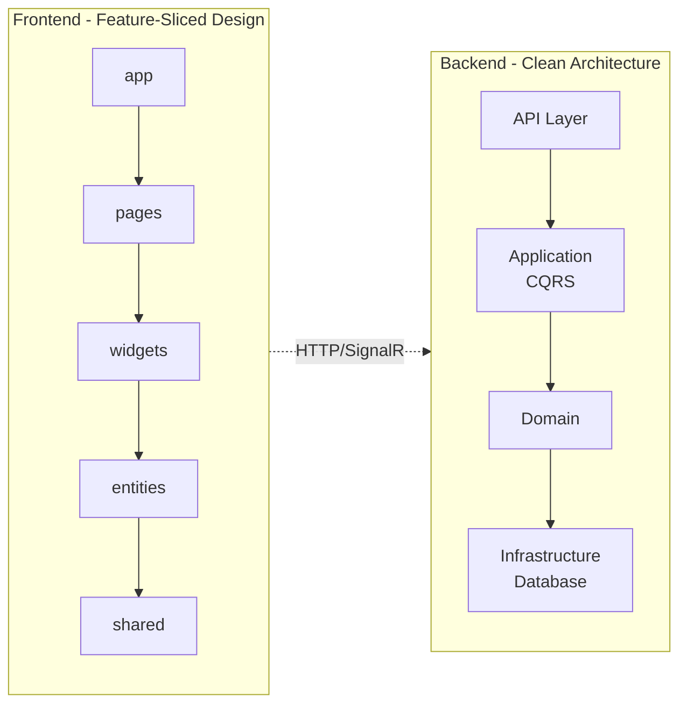

# Whithin Messenger

Современный мессенджер с Clean Architecture (Backend) и Feature-Sliced Design (Frontend).

> **📌 Просмотр диаграмм:** Для корректного отображения установите [Markdown Preview Mermaid Support](https://marketplace.visualstudio.com/items?itemName=bierner.markdown-mermaid) в VS Code или откройте на GitHub.

## Возможности

- 💬 Личные и групповые чаты, серверы с каналами
- 📁 Медиафайлы (изображения, видео, аудио, документы)
- 👥 Система друзей и уведомления
- ⚡ Real-time обновления через SignalR

## Технологии

**Backend:** ASP.NET Core 8.0 • PostgreSQL • EF Core • SignalR • MediatR (CQRS)

**Frontend:** React 19 • Vite • SignalR Client • Material-UI • React Router

**DevOps:** Docker • Docker Compose

## Архитектура

<details>
<summary>📊 Показать диаграмму</summary>



</details>

**Backend (Clean Architecture):**
```
API Layer → Application (CQRS) → Domain → Infrastructure (DB)
```

**Frontend (Feature-Sliced Design):**
```
app → pages → widgets → entities → shared
```

## Быстрый старт

### Docker
```bash
cd WhithinMessenger.Backend
docker-compose up -d

cd ../WhithinMessenger.Client  
npm install && npm run dev
```

### Локально

**Требования:** .NET 8, Node.js 18+, PostgreSQL 15+

```bash
# База данных
createdb whithin_db

# Backend
cd WhithinMessenger.Backend/src/WhithinMessenger.Api
# Обновить appsettings.Development.json
dotnet ef database update --project ../WhithinMessenger.Infrastructure
dotnet run  # https://localhost:5117

# Frontend
cd ../../../WhithinMessenger.Client
npm install && npm run dev  # http://localhost:5173
```

## Документация

- [Установка](./docs/INSTALLATION.md) - установка и настройка
- [Архитектура](./docs/ARCHITECTURE.md) - описание архитектуры
- [Модули](./docs/modules/README.md) - документация по модулям системы
- [Диаграммы](./docs/diagrams/README.md) - UML диаграммы (PlantUML)
- [Backend](./docs/BACKEND.md) - ASP.NET Core API
- [Frontend](./docs/FRONTEND.md) - React Client
- [API Endpoints](./WhithinMessenger.Backend/Endpoints.md) - список endpoints

## Структура проекта

```
NewProject/
├── WhithinMessenger.Backend/
│   └── src/
│       ├── Api/              # Controllers, Hubs
│       ├── Application/      # Commands, Queries (CQRS)
│       ├── Domain/           # Entities, Interfaces
│       └── Infrastructure/   # Database, Repositories
│
└── WhithinMessenger.Client/
    └── src/
        ├── app/             # Конфигурация
        ├── pages/           # Страницы приложения
        ├── widgets/         # Композитные блоки
        ├── entities/        # Бизнес-сущности
        └── shared/          # Общий код (UI, hooks, utils)
```

## API

После запуска backend:
- API: `https://localhost:5117/api`
- Документация: `https://localhost:5117/scalar/v1`
- SignalR Hubs: `/groupchathub`, `/chatlisthub`, `/serverhub`

## Основные функции

**Чаты:**
- Отправка/редактирование/удаление сообщений
- Ответы и пересылка сообщений
- Поиск по сообщениям
- Отметка как прочитанное

**Серверы:**
- Создание серверов и каналов
- Категории каналов
- Система ролей и разрешений
- Публичные/приватные серверы

**Медиа:**
- Загрузка файлов (до 100MB)
- Предпросмотр изображений и видео
- Аудио с визуализацией (WaveSurfer)

## Разработка

```bash
# Backend (с hot-reload)
cd WhithinMessenger.Backend/src/WhithinMessenger.Api
dotnet watch run

# Frontend (с HMR)
cd WhithinMessenger.Client
npm run dev

# Новая миграция БД
dotnet ef migrations add MigrationName --project ../WhithinMessenger.Infrastructure
```

## Сборка для продакшена

```bash
# Backend
dotnet publish -c Release -o ./publish

# Frontend
npm run build  # → dist/
```

## Contributing

См. [CONTRIBUTING.md](./CONTRIBUTING.md) для деталей о процессе разработки.

## Лицензия

MIT License - см. [LICENSE](./LICENSE)

---

**Версия:** 1.0.0  
**Документация:** [docs/](./docs/)
