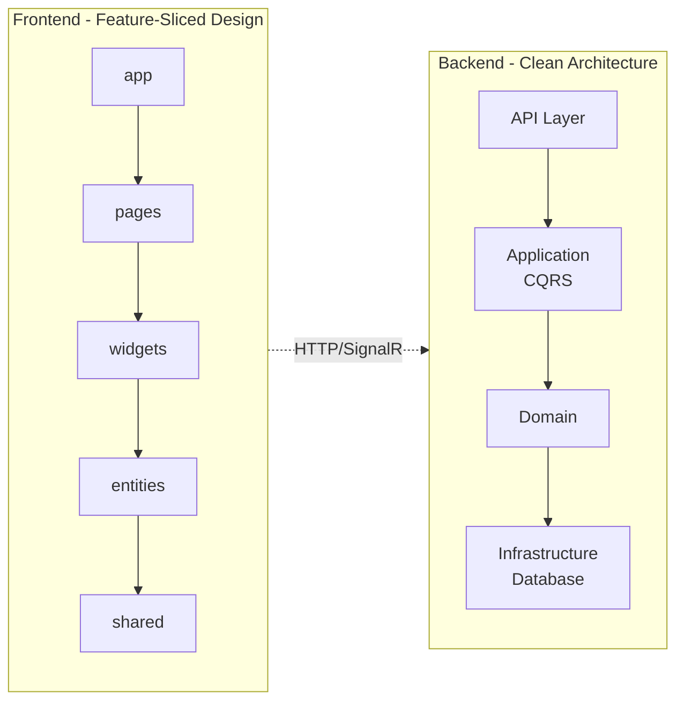

# Whithin Messenger

## Технологии

**Backend:** ASP.NET Core 9.0 • PostgreSQL • EF Core • SignalR • MediatR (CQRS)

**Frontend:** React 19 • Vite • SignalR Client • Material-UI • React Router

**DevOps:** Docker • Docker Compose

## Архитектура

<details>
<summary>Показать диаграмму</summary>



</details>

**Backend (Clean Architecture):**
```
API Layer → Application (CQRS) → Domain → Infrastructure (DB)
```

**Frontend (Feature-Sliced Design):**
```
app → pages → widgets → entities → shared
```

## Документация

- [Установка](./docs/INSTALLATION.md) - установка и настройка
- [Архитектура](./docs/ARCHITECTURE.md) - описание архитектуры
- [Модули](./docs/modules/README.md) - документация по модулям системы
- [Диаграммы](./docs/diagrams/README.md) - UML диаграммы (PlantUML)
- [Backend](./docs/BACKEND.md) - ASP.NET Core API
- [Frontend](./docs/FRONTEND.md) - React Client
- [API Endpoints](./WhithinMessenger.Backend/Endpoints.md) - список endpoints

## Структура проекта

```
NewProject/
├── WhithinMessenger.Backend/
│   └── src/
│       ├── Api/              # Controllers, Hubs
│       ├── Application/      # Commands, Queries (CQRS)
│       ├── Domain/           # Entities, Interfaces
│       └── Infrastructure/   # Database, Repositories
│
└── WhithinMessenger.Client/
    └── src/
        ├── app/             # Конфигурация
        ├── pages/           # Страницы приложения
        ├── widgets/         # Композитные блоки
        ├── entities/        # Бизнес-сущности
        └── shared/          # Общий код (UI, hooks, utils)
```

## Основные функции

**Чаты:**
- Отправка/редактирование/удаление сообщений
- Ответы и пересылка сообщений
- Поиск по сообщениям
- Отметка как прочитанное

**Серверы:**
- Создание серверов и каналов
- Категории каналов
- Система ролей и разрешений
- Публичные/приватные серверы

**Медиа:**
- Загрузка файлов (до 100MB)
- Предпросмотр изображений и видео
- Аудио с визуализацией (WaveSurfer)

**Документация:** [docs/](./docs/)
