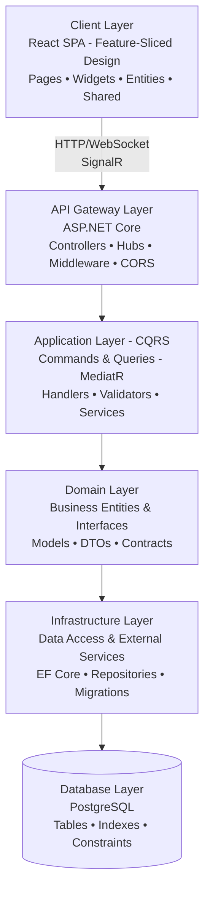
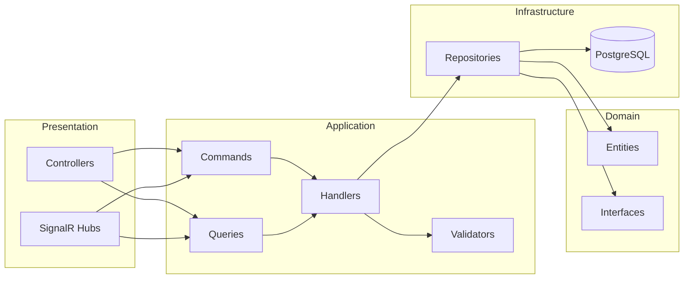
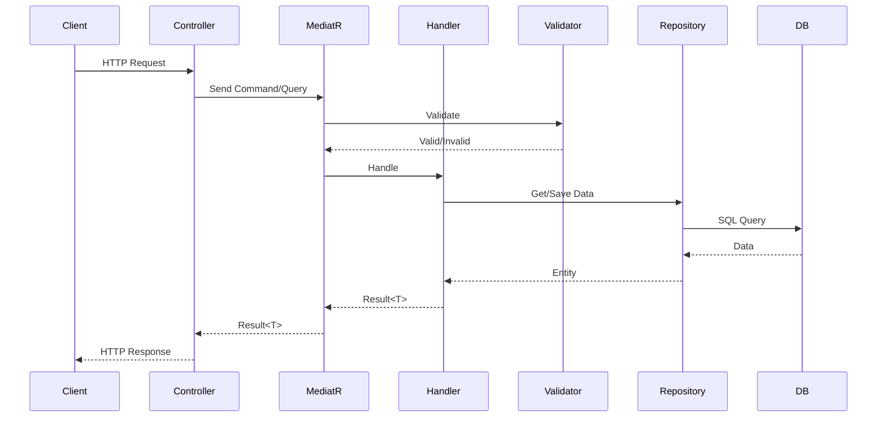
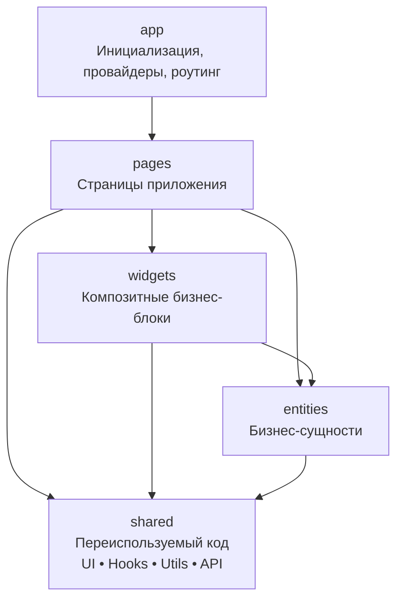
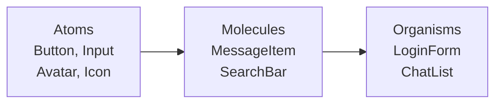
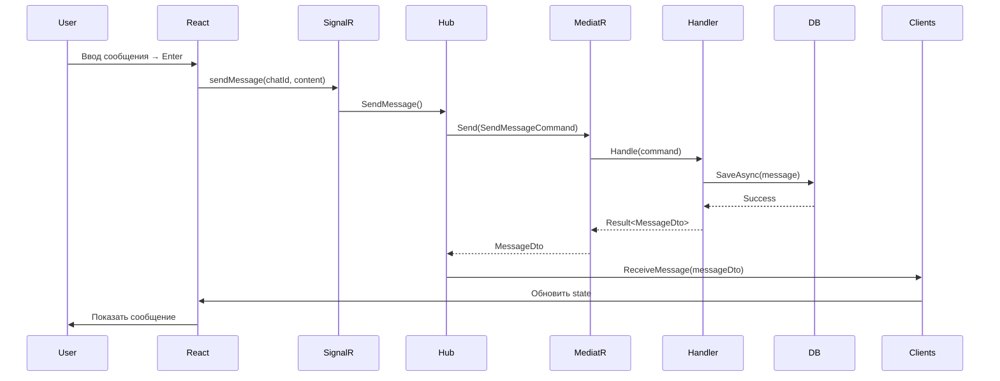
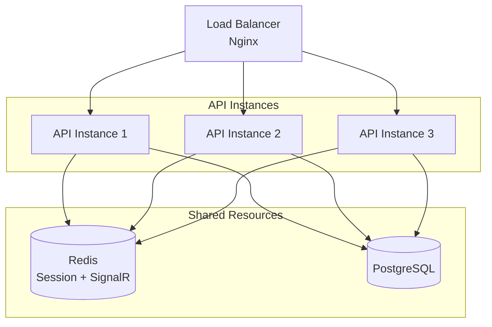
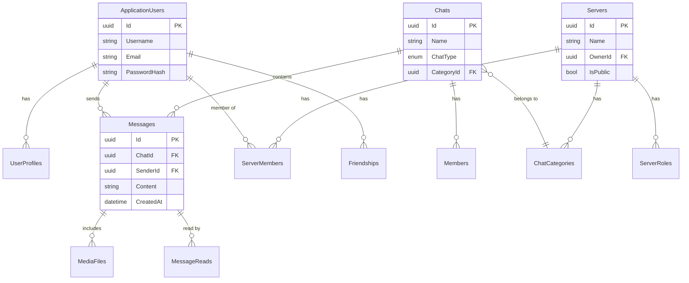

# Архитектура Whithin Messenger

## Обзор системы

### Высокоуровневая архитектура

## Backend Architecture

### Clean Architecture Flow

### CQRS Pattern

## Frontend Architecture

### Feature-Sliced Design

### Atomic Design (UI)

## Взаимодействие компонентов

### Отправка сообщения

## Паттерны проектирования

### Backend Patterns

- **CQRS** - разделение команд (изменение) и запросов (чтение)
- **Repository** - абстракция доступа к данным
- **Mediator** - централизованная обработка через MediatR
- **Dependency Injection** - IoC контейнер
- **Result Pattern** - типизированная обработка ошибок

### Frontend Patterns

- **Feature-Sliced Design** - модульная архитектура
- **Atomic Design** - иерархия UI компонентов
- **Custom Hooks** - переиспользование логики
- **Context API** - глобальное состояние
- **Observer** - подписка на SignalR события

## Масштабируемость

### Горизонтальное масштабирование

## База данных

### Entity Relationship

---

