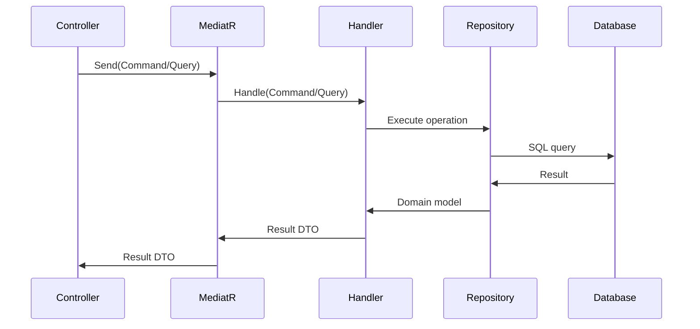
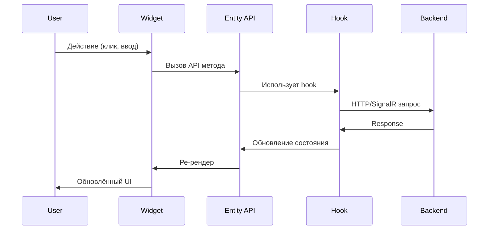
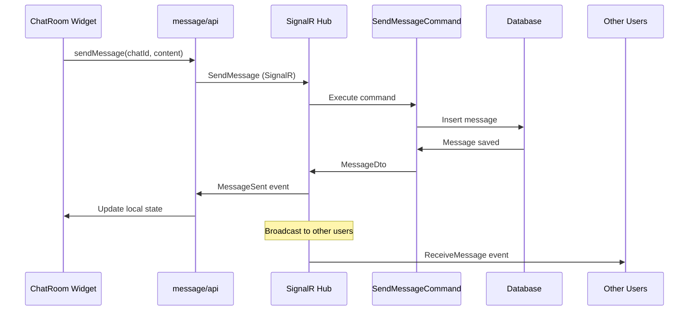
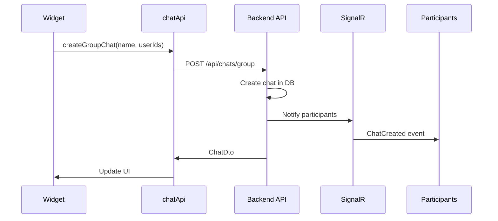
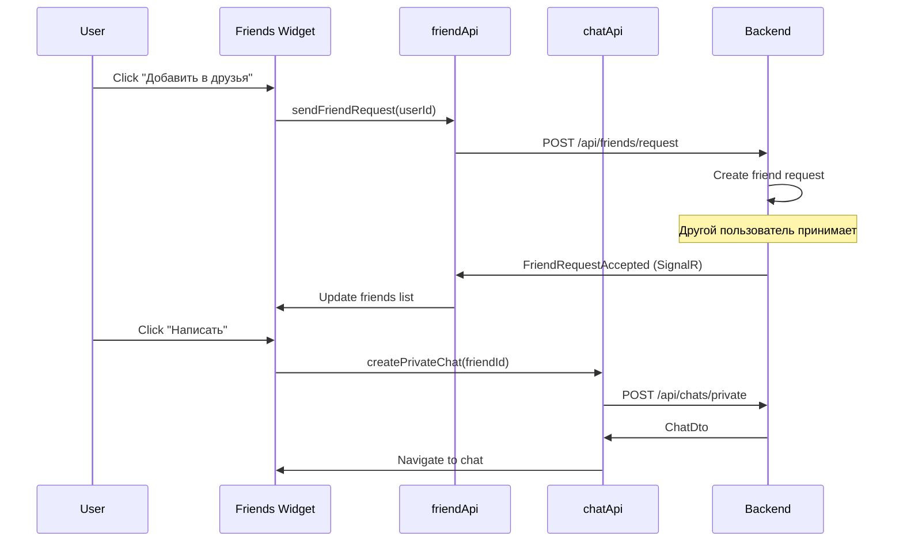
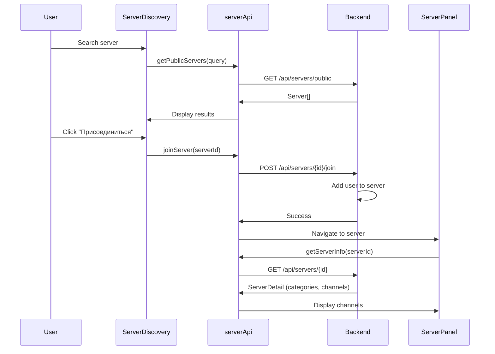
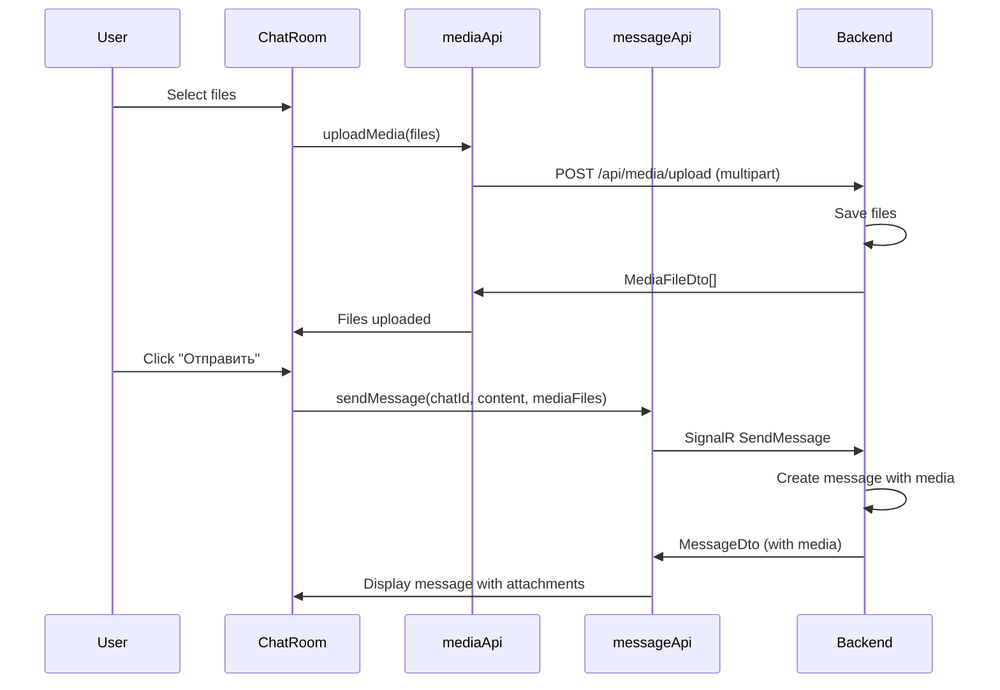
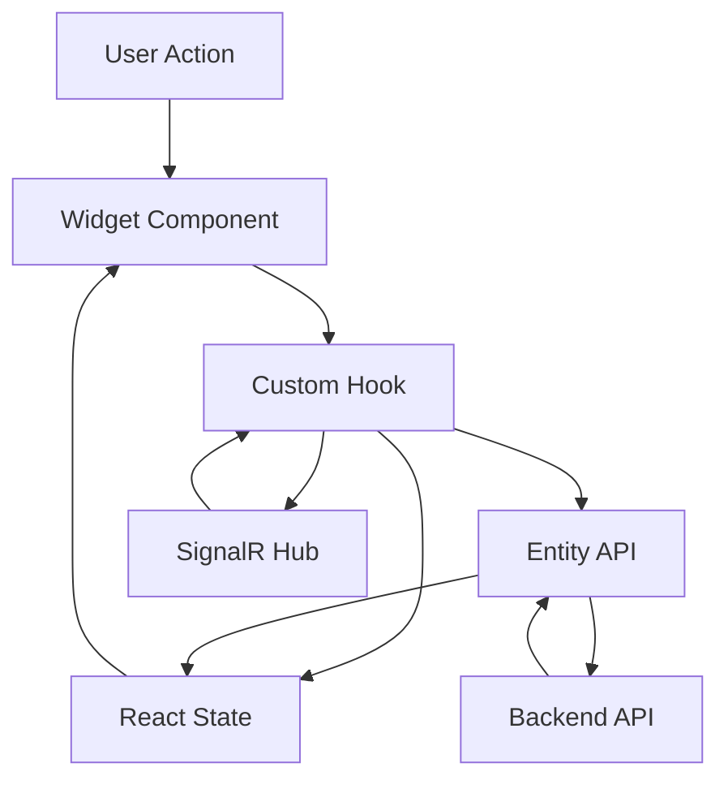
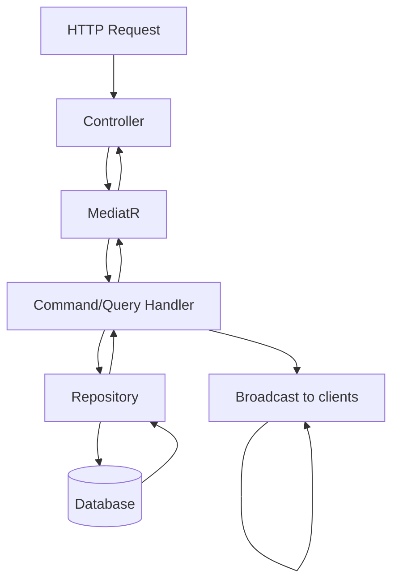

# Взаимодействие модулей

Описание того, как модули Backend и Frontend взаимодействуют друг с другом.

## Backend: Command/Query Flow



### Пример: Отправка сообщения

**1. Controller получает запрос**:
```csharp
[HttpPost]
public async Task<IActionResult> SendMessage([FromBody] SendMessageRequest request) {
    var command = new SendMessageCommand {
        ChatId = request.ChatId,
        SenderId = GetCurrentUserId(),
        Content = request.Content
    };
    
    var result = await _mediator.Send(command);
    return Ok(result);
}
```

**2. MediatR передаёт Handler**:
```csharp
public class SendMessageCommandHandler : IRequestHandler<SendMessageCommand, MessageDto> {
    private readonly IMessageRepository _messageRepo;
    
    public async Task<MessageDto> Handle(SendMessageCommand request, CancellationToken ct) {
        var message = new Message {
            ChatId = request.ChatId,
            SenderId = request.SenderId,
            Content = request.Content,
            Timestamp = DateTime.UtcNow
        };
        
        await _messageRepo.AddAsync(message);
        
        return MapToDto(message);
    }
}
```

**3. Repository выполняет операцию**:
```csharp
public class MessageRepository : IMessageRepository {
    private readonly MessengerContext _context;
    
    public async Task AddAsync(Message message) {
        _context.Messages.Add(message);
        await _context.SaveChangesAsync();
    }
}
```

---

## Frontend: User Action Flow



### Пример: Отправка сообщения

**1. Widget (ChatRoom)**:
```jsx
export const ChatRoom = ({ chatId }) => {
  const { sendMessage } = useChatRoom(chatId);
  
  const handleSend = (content) => {
    sendMessage(content);
  };
  
  return <MessageInput onSend={handleSend} />;
};
```

**2. Hook (useChatRoom)**:
```javascript
export const useChatRoom = (chatId) => {
  const { connection } = useConnection();
  const [messages, setMessages] = useState([]);
  
  const sendMessage = async (content) => {
    await connection.invoke('SendMessage', chatId, content);
  };
  
  useEffect(() => {
    connection.on('ReceiveMessage', (message) => {
      setMessages(prev => [...prev, message]);
    });
  }, [connection]);
  
  return { messages, sendMessage };
};
```

**3. Entity API (messageApi)**:
```javascript
export const messageApi = {
  sendMessage: async (chatId, content, mediaFiles, replyToId) => {
    return apiClient.post('/messages', {
      chatId,
      content,
      mediaFileIds: mediaFiles?.map(f => f.id) || [],
      replyToMessageId: replyToId
    });
  }
};
```

---

## HTTP + SignalR взаимодействие

### Отправка сообщения



### Создание чата



---

## Примеры интеграции модулей

### 1. Добавление друга → Создание чата



### 2. Присоединение к серверу → Загрузка каналов



### 3. Загрузка медиа → Отправка сообщения



---

## Управление состоянием

### Frontend State Flow



### Backend Data Flow



---

## Real-time обновления через SignalR

### Backend Hubs

**GroupChatHub**:
```csharp
public class GroupChatHub : Hub {
    public async Task SendMessage(Guid chatId, string content) {
        var command = new SendMessageCommand { ... };
        var message = await _mediator.Send(command);
        
        // Broadcast всем участникам чата
        await Clients.Group(chatId.ToString())
            .SendAsync("ReceiveMessage", message);
    }
    
    public async Task JoinChat(Guid chatId) {
        await Groups.AddToGroupAsync(Context.ConnectionId, chatId.ToString());
    }
}
```

**ServerHub**:
```csharp
public class ServerHub : Hub {
    public async Task JoinServer(Guid serverId) {
        await Groups.AddToGroupAsync(Context.ConnectionId, $"server_{serverId}");
    }
    
    public async Task NotifyMemberJoined(Guid serverId, Guid userId) {
        await Clients.Group($"server_{serverId}")
            .SendAsync("MemberJoined", userId);
    }
}
```

### Frontend Connections

```javascript
// ConnectionContext.jsx
const connection = new signalR.HubConnectionBuilder()
  .withUrl('https://localhost:5117/groupchathub')
  .withAutomaticReconnect()
  .build();

// Подписка на события
connection.on('ReceiveMessage', (message) => {
  // Обновить UI
});

connection.on('UserJoined', (user) => {
  // Обновить список участников
});
```

---

## Error Handling

### Backend

```csharp
public class GlobalExceptionMiddleware {
    public async Task InvokeAsync(HttpContext context, RequestDelegate next) {
        try {
            await next(context);
        }
        catch (NotFoundException ex) {
            context.Response.StatusCode = 404;
            await context.Response.WriteAsJsonAsync(new { error = ex.Message });
        }
        catch (ValidationException ex) {
            context.Response.StatusCode = 400;
            await context.Response.WriteAsJsonAsync(new { errors = ex.Errors });
        }
        catch (Exception ex) {
            context.Response.StatusCode = 500;
            await context.Response.WriteAsJsonAsync(new { error = "Internal server error" });
        }
    }
}
```

### Frontend

```javascript
// apiClient.js
apiClient.interceptors.response.use(
  (response) => response.data,
  (error) => {
    if (error.response?.status === 404) {
      // Show not found message
      toast.error('Ресурс не найден');
    }
    else if (error.response?.status === 400) {
      // Validation error
      toast.error('Ошибка валидации');
    }
    else {
      // Show generic error
      toast.error('Произошла ошибка');
    }
    return Promise.reject(error);
  }
);
```

---

[← Назад к модулям](README.md)

