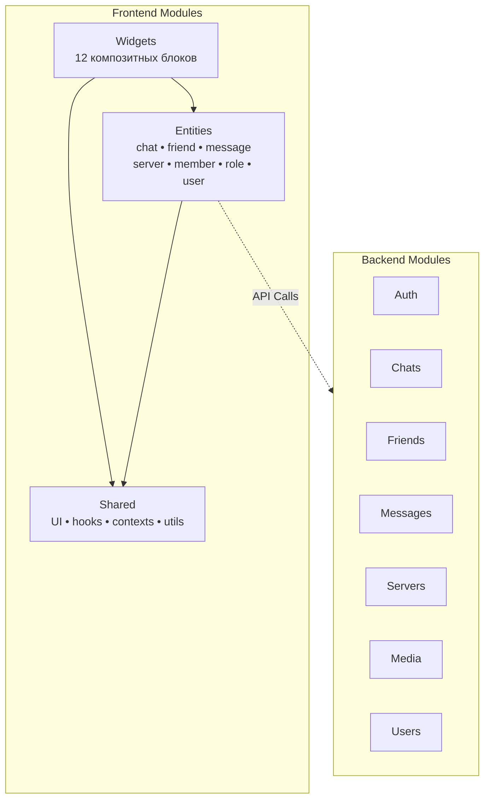

# Документация модулей

Документация разделена по Backend и Frontend модулям для удобной навигации.

## Backend модули (CQRS)

Backend построен на CQRS паттерне. Каждый модуль содержит Commands (изменение) и Queries (чтение).

| Модуль | Описание | Документация |
|--------|----------|--------------|
| **Auth** | Аутентификация и регистрация | [AUTH.md](./backend/AUTH.md) |
| **Chats** | Управление чатами | [CHATS.md](./backend/CHATS.md) |
| **Friends** | Система друзей | [FRIENDS.md](./backend/FRIENDS.md) |
| **Messages** | Сообщения | [MESSAGES.md](./backend/MESSAGES.md) |
| **Servers** | Серверы и каналы | [SERVERS.md](./backend/SERVERS.md) |
| **Media** | Медиафайлы | [MEDIA.md](./backend/MEDIA.md) |
| **Users** | Профили пользователей | [USERS.md](./backend/USERS.md) |

## Frontend модули (FSD)

Frontend построен на Feature-Sliced Design архитектуре.

| Слой | Описание | Документация |
|------|----------|--------------|
| **Entities** | Бизнес-сущности (7 модулей) | [ENTITIES.md](./frontend/ENTITIES.md) |
| **Widgets** | Композиционные блоки (12 модулей) | [WIDGETS.md](./frontend/WIDGETS.md) |
| **Shared** | Переиспользуемый код | [SHARED.md](./frontend/SHARED.md) |

## Взаимодействие

| Документ | Описание |
|----------|----------|
| [INTERACTION.md](./INTERACTION.md) | Взаимодействие между модулями |

## Архитектура модулей

## Быстрая навигация

**Backend разработчик?**
- Начни с [Backend модулей](./backend/)
- Изучи [CQRS паттерн](./INTERACTION.md#backend-commandquery-flow)

**Frontend разработчик?**
- Начни с [Entities](./frontend/ENTITIES.md)
- Изучи [Widgets](./frontend/WIDGETS.md)
- Посмотри [Shared компоненты](./frontend/SHARED.md)

**Архитектор?**
- Изучи [Взаимодействие модулей](./INTERACTION.md)

---

[← Назад к документации](../README.md)

