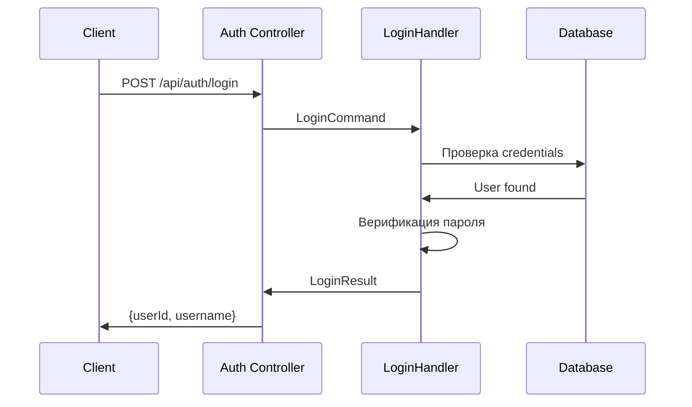

# Auth Module

**Назначение**: Аутентификация и регистрация пользователей

**Расположение**: `WhithinMessenger.Application/CommandsAndQueries/Auth/`

## Структура

```
Auth/
├── Login/
│   ├── LoginCommand.cs
│   ├── LoginCommandHandler.cs
│   └── LoginResult.cs
└── Register/
    ├── RegisterCommand.cs
    ├── RegisterCommandHandler.cs
    └── RegisterResult.cs
```

## Commands/Queries

### LoginCommand

**Тип**: Query (хотя технически это команда, но не изменяет данные пользователя)

**Параметры**:
```csharp
public record LoginCommand(string Username, string Password) : IRequest<LoginResult>;
```

**Возвращает**:
```csharp
LoginResult {
  UserId,
  Username
}
```

**Использование**:
```csharp
var result = await mediator.Send(new LoginCommand("username", "password"));
```

---

### RegisterCommand

**Тип**: Command

**Параметры**:
```csharp
public record RegisterCommand(
  string Username,
  string Password,
  string Email
) : IRequest<RegisterResult>;
```

**Возвращает**:
```csharp
RegisterResult {
  UserId,
  Username
}
```

**Использование**:
```csharp
var result = await mediator.Send(new RegisterCommand(
  "username",
  "password",
  "email@example.com"
));
```

## Процесс аутентификации



## Endpoints

**Login**: `POST /api/auth/login`
```json
{
  "username": "string",
  "password": "string"
}
```

**Register**: `POST /api/auth/register`
```json
{
  "username": "string",
  "password": "string",
  "email": "string"
}
```

## Валидация

**Username**:
- Минимум 3 символа
- Максимум 20 символов
- Только буквы, цифры, подчёркивание

**Password**:
- Минимум 6 символов
- Обязательно хешируется (BCrypt)

**Email**:
- Валидный email формат
- Уникальный в системе

## Безопасность

- Пароли хешируются с использованием BCrypt
- Валидация входных данных на уровне команд
- Уникальность username и email проверяется при регистрации

## Связанные модули

- **Users Module** - получение профиля после аутентификации
- **Frontend**: `shared/lib/api/authApi.js`

---

[← Назад к модулям](../README.md) | [Backend модули](./README.md)

