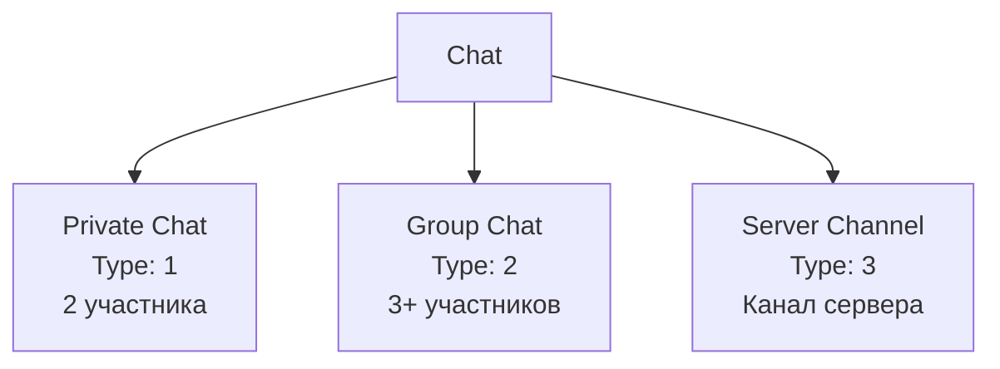
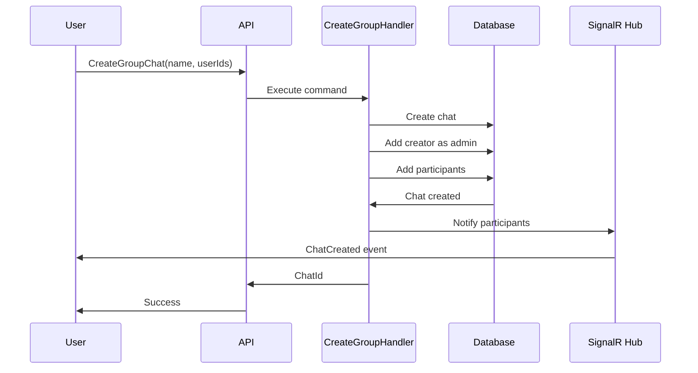

# Chats Module

**Назначение**: Управление чатами (приватные, групповые, серверные)

**Расположение**: `WhithinMessenger.Application/CommandsAndQueries/Chats/`

## Типы чатов



**Константы**:
- `Private = 1` - приватный чат между двумя пользователями
- `Group = 2` - групповой чат
- `Server = 3` - канал сервера

## Commands

### CreatePrivateChatCommand

**Параметры**:
```csharp
CreatePrivateChatCommand {
  UserId,      // ID второго пользователя
  InitiatorId  // ID создателя
}
```

**Возвращает**: `CreatePrivateChatResult { ChatId }`

**Логика**:
- Проверяет, что чат между пользователями не существует
- Создаёт приватный чат
- Добавляет обоих участников

---

### CreateGroupChatCommand

**Параметры**:
```csharp
CreateGroupChatCommand {
  Name,         // Название группы
  CreatorId,    // ID создателя
  UserIds[]     // Список участников
}
```

**Возвращает**: `CreateGroupChatResult { ChatId, Name }`

**Логика**:
- Создаёт групповой чат
- Добавляет создателя как администратора
- Добавляет указанных участников

---

### AddUserToGroupCommand

**Параметры**:
```csharp
AddUserToGroupCommand {
  ChatId,
  UserId
}
```

**Возвращает**: `AddUserToGroupResult { Success }`

**Ограничения**:
- Только для групповых чатов (Type = 2)
- Только администраторы могут добавлять

---

### UpdateChatAvatarCommand

**Параметры**:
```csharp
UpdateChatAvatarCommand {
  ChatId,
  AvatarUrl
}
```

**Возвращает**: `void`

---

### DeletePrivateChatCommand

**Параметры**:
```csharp
DeletePrivateChatCommand {
  ChatId,
  UserId  // Для проверки прав
}
```

**Возвращает**: `void`

**Особенности**:
- Мягкое удаление (soft delete)
- Скрывает чат для пользователя

## Queries

### GetUserChatsQuery

**Параметры**:
```csharp
GetUserChatsQuery {
  UserId
}
```

**Возвращает**:
```csharp
GetUserChatsResult {
  Chats[] {
    ChatId,
    Name,
    Type,
    AvatarUrl,
    LastMessage,
    UnreadCount,
    Participants[]
  }
}
```

---

### GetChatInfoQuery

**Параметры**:
```csharp
GetChatInfoQuery {
  ChatId
}
```

**Возвращает**:
```csharp
ChatInfo {
  ChatId,
  Name,
  Type,
  AvatarUrl,
  CreatedAt,
  ParticipantsCount
}
```

---

### GetChatParticipantsQuery

**Параметры**:
```csharp
GetChatParticipantsQuery {
  ChatId
}
```

**Возвращает**:
```csharp
GetChatParticipantsResult {
  Participants[] {
    UserId,
    Username,
    AvatarUrl,
    IsAdmin,
    JoinedAt
  }
}
```

---

### GetAvailableUsersQuery

**Параметры**:
```csharp
GetAvailableUsersQuery {
  ChatId,
  SearchTerm  // Опционально
}
```

**Возвращает**: Список пользователей, которых можно добавить в группу

## Процесс создания группового чата



## Endpoints

**Create Private Chat**: `POST /api/chats/private`
```json
{
  "userId": "guid"
}
```

**Create Group Chat**: `POST /api/chats/group`
```json
{
  "name": "string",
  "userIds": ["guid1", "guid2"]
}
```

**Get User Chats**: `GET /api/chats`

**Get Chat Info**: `GET /api/chats/{chatId}`

**Add User to Group**: `POST /api/chats/{chatId}/members`
```json
{
  "userId": "guid"
}
```

**Update Avatar**: `PUT /api/chats/{chatId}/avatar`
```json
{
  "avatarUrl": "string"
}
```

## SignalR Events

**ChatCreated**: Отправляется всем участникам при создании чата

**UserAddedToChat**: Отправляется когда пользователь добавлен

**ChatAvatarUpdated**: Обновление аватара чата

## Связанные модули

- **Messages Module** - отправка сообщений в чат
- **Users Module** - информация об участниках
- **Media Module** - загрузка аватаров
- **Frontend**: `entities/chat`

---

[← Назад к модулям](../README.md) | [Backend модули](./README.md)


