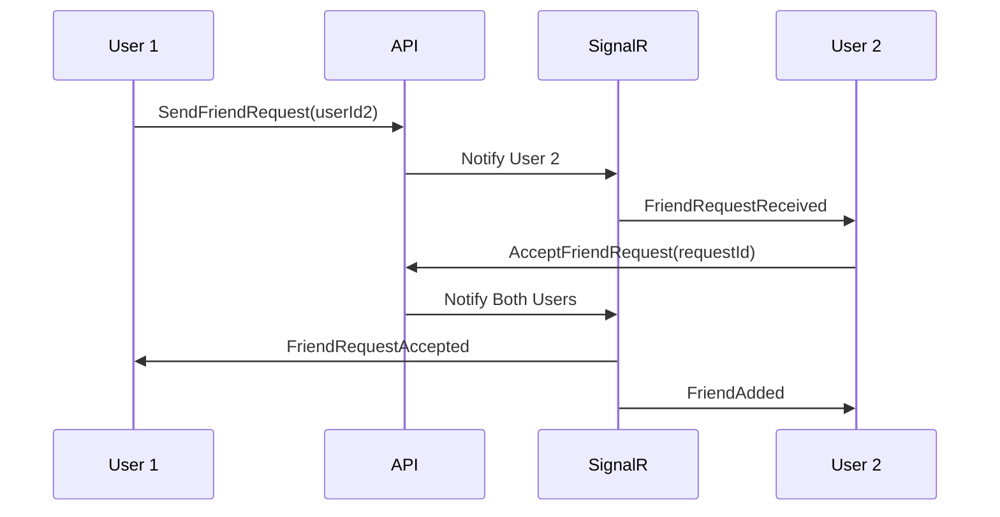
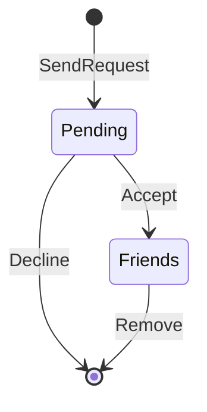

# Friends Module

**Назначение**: Система друзей и заявок в друзья

**Расположение**: `WhithinMessenger.Application/CommandsAndQueries/Friends/`

## Процесс добавления в друзья



## Commands

### SendFriendRequestCommand

**Параметры**:
```csharp
SendFriendRequestCommand {
  SenderId,     // Кто отправляет
  ReceiverId    // Кому отправляет
}
```

**Возвращает**: `SendFriendRequestResult { RequestId, Success }`

**Валидация**:
- Нельзя отправить заявку самому себе
- Нельзя отправить если уже друзья
- Нельзя отправить если уже есть ожидающая заявка

---

### AcceptFriendRequestCommand

**Параметры**:
```csharp
AcceptFriendRequestCommand {
  RequestId,
  UserId    // Кто принимает
}
```

**Возвращает**: `AcceptFriendRequestResult { Success }`

**Логика**:
- Проверяет что заявка существует
- Создаёт дружбу в обе стороны
- Удаляет заявку
- Отправляет уведомления обоим пользователям

---

### DeclineFriendRequestCommand

**Параметры**:
```csharp
DeclineFriendRequestCommand {
  RequestId,
  UserId
}
```

**Возвращает**: `DeclineFriendRequestResult { Success }`

**Логика**:
- Удаляет заявку
- Отправляет уведомление отправителю

---

### RemoveFriendCommand

**Параметры**:
```csharp
RemoveFriendCommand {
  UserId,
  FriendId
}
```

**Возвращает**: `RemoveFriendResult { Success }`

**Логика**:
- Удаляет дружбу в обе стороны
- Отправляет уведомления

## Queries

### GetFriendsQuery

**Параметры**:
```csharp
GetFriendsQuery {
  UserId
}
```

**Возвращает**:
```csharp
GetFriendsResult {
  Friends[] {
    UserId,
    Username,
    AvatarUrl,
    Status,      // Online/Offline/Away
    LastSeen
  }
}
```

---

### GetFriendRequestsQuery

**Параметры**:
```csharp
GetFriendRequestsQuery {
  UserId
}
```

**Возвращает**:
```csharp
GetFriendRequestsResult {
  Requests[] {
    RequestId,
    SenderId,
    SenderUsername,
    SenderAvatarUrl,
    SentAt
  }
}
```

**Особенности**:
- Возвращает только входящие заявки
- Сортировка по дате (новые сверху)

## Статусы дружбы



**Состояния**:
- `Pending` - ожидает принятия
- `Friends` - друзья
- `Deleted` - удалена

## Endpoints

**Send Friend Request**: `POST /api/friends/request`
```json
{
  "receiverId": "guid"
}
```

**Accept Request**: `POST /api/friends/accept/{requestId}`

**Decline Request**: `POST /api/friends/decline/{requestId}`

**Remove Friend**: `DELETE /api/friends/{friendId}`

**Get Friends**: `GET /api/friends`

**Get Friend Requests**: `GET /api/friends/requests`

## SignalR Events

**FriendRequestReceived**: 
```json
{
  "requestId": "guid",
  "senderId": "guid",
  "senderUsername": "string"
}
```

**FriendRequestAccepted**:
```json
{
  "friendId": "guid",
  "friendUsername": "string"
}
```

**FriendRequestDeclined**:
```json
{
  "requestId": "guid"
}
```

**FriendRemoved**:
```json
{
  "friendId": "guid"
}
```

## База данных

**Таблица Friendship**:
```sql
CREATE TABLE Friendship (
  Id UUID PRIMARY KEY,
  User1Id UUID NOT NULL,
  User2Id UUID NOT NULL,
  Status INT NOT NULL,  -- 0: Pending, 1: Accepted, 2: Deleted
  CreatedAt TIMESTAMP,
  FOREIGN KEY (User1Id) REFERENCES Users(Id),
  FOREIGN KEY (User2Id) REFERENCES Users(Id)
);
```

**Индексы**:
- `IX_Friendship_User1Id`
- `IX_Friendship_User2Id`
- `IX_Friendship_Status`

## Уведомления

При каждом действии отправляется уведомление:
- **Отправка заявки** → уведомление получателю
- **Принятие заявки** → уведомление отправителю
- **Отклонение заявки** → уведомление отправителю
- **Удаление из друзей** → уведомление бывшему другу

## Связанные модули

- **Users Module** - информация о пользователях
- **Notifications Module** - система уведомлений
- **Chats Module** - создание приватных чатов с друзьями
- **Frontend**: `entities/friend`

---

[← Назад к модулям](../README.md) | [Backend модули](./README.md)


