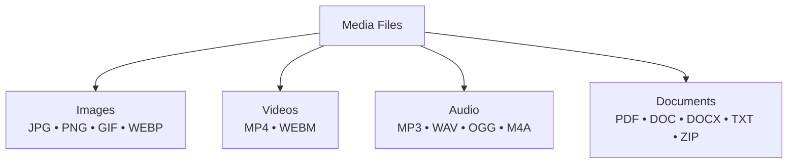
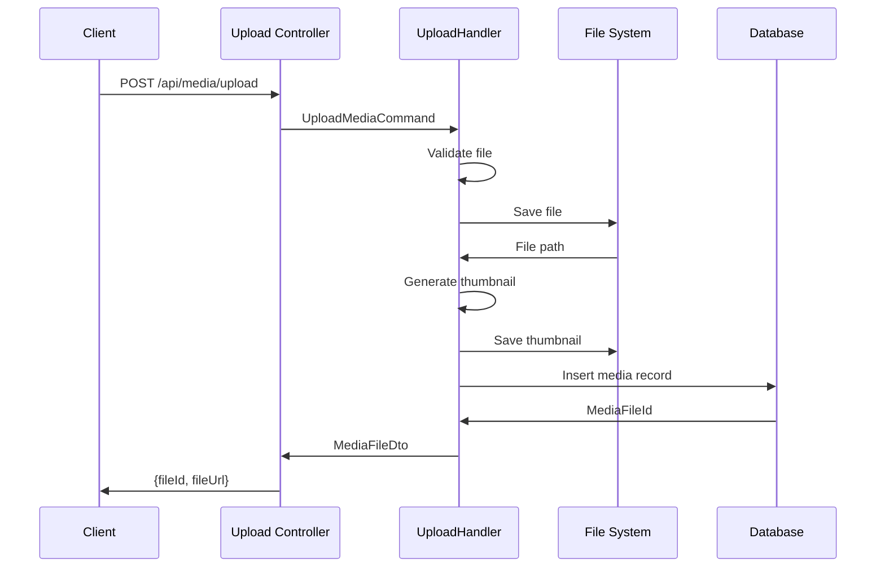

# Media Module

**Назначение**: Загрузка, хранение и управление медиафайлами

**Расположение**: `WhithinMessenger.Application/CommandsAndQueries/Media/`

## Поддерживаемые типы файлов



## Ограничения

- **Максимальный размер файла**: 100 MB
- **Максимум файлов в одном сообщении**: 10
- **Поддерживаемые форматы**: см. таблицу ниже

| Тип | Форматы | Max размер |
|-----|---------|-----------|
| Изображения | JPG, PNG, GIF, WEBP | 10 MB |
| Видео | MP4, WEBM | 100 MB |
| Аудио | MP3, WAV, OGG, M4A | 25 MB |
| Документы | PDF, DOC, DOCX, TXT, ZIP | 50 MB |

## Commands

### UploadMediaCommand

**Параметры**:
```csharp
UploadMediaCommand {
  File: IFormFile,
  UploadedBy: Guid,
  ChatId: Guid?
}
```

**Возвращает**:
```csharp
MediaFileDto {
  MediaFileId: Guid,
  FileName: string,
  FileUrl: string,
  FileType: string,
  FileSize: long,
  ThumbnailUrl: string?,
  UploadedAt: DateTime
}
```

**Логика**:
1. Валидация типа и размера файла
2. Генерация уникального имени
3. Сохранение на диск/облако
4. Создание thumbnail для изображений/видео
5. Запись в БД
6. Возврат URL файла

**Хранение**:
```
Uploads/
├── images/
│   ├── {guid}.jpg
│   └── thumbnails/
│       └── {guid}_thumb.jpg
├── videos/
├── audio/
└── documents/
```

---

### DeleteMediaCommand

**Параметры**:
```csharp
DeleteMediaCommand {
  MediaFileId: Guid,
  UserId: Guid
}
```

**Права**:
- Автор файла
- Администратор чата/сервера

**Логика**:
- Удаление файла с диска
- Удаление thumbnail
- Soft delete в БД

## Queries

### GetMediaFilesQuery

**Параметры**:
```csharp
GetMediaFilesQuery {
  ChatId: Guid,
  UserId: Guid,
  FileType: MediaFileType?,  // Фильтр по типу
  Page: int,
  PageSize: int
}
```

**Возвращает**:
```csharp
{
  MediaFiles: MediaFileDto[],
  TotalCount: int
}
```

**Использование**:
- Галерея медиа в чате
- Поиск файлов

## Процесс загрузки



## MediaFileDto

```csharp
public class MediaFileDto {
  public Guid MediaFileId { get; set; }
  public string FileName { get; set; }
  public string FileUrl { get; set; }
  public string FileType { get; set; }  // image/jpeg, video/mp4, etc.
  public long FileSize { get; set; }
  public string? ThumbnailUrl { get; set; }
  public Guid UploadedBy { get; set; }
  public DateTime UploadedAt { get; set; }
  public int? Width { get; set; }
  public int? Height { get; set; }
  public int? Duration { get; set; }  // Для видео/аудио в секундах
}
```

## Типы файлов (Enum)

```csharp
public enum MediaFileType {
  Image = 1,
  Video = 2,
  Audio = 3,
  Document = 4
}
```

## Endpoints

**Upload File**: `POST /api/media/upload`
```
Content-Type: multipart/form-data
{
  file: (binary),
  chatId: "guid"
}
```

**Delete File**: `DELETE /api/media/{mediaFileId}`

**Get Media Files**: `GET /api/media/chat/{chatId}?type=image&page=1&pageSize=20`

**Download File**: `GET /api/media/download/{mediaFileId}`

## Thumbnail генерация

**Изображения**:
- Размер: 200x200px
- Формат: JPEG (качество 80%)
- Сохранение пропорций

**Видео**:
- Кадр на 1 секунде
- Размер: 320x180px
- Формат: JPEG

**Аудио**:
- Waveform визуализация (опционально)

## Безопасность

**Валидация**:
- Проверка MIME-type
- Проверка расширения файла
- Проверка magic bytes (первые байты файла)
- Проверка размера

**Защита**:
- Уникальные имена файлов (GUID)
- Изоляция от исполняемых файлов
- Проверка на вирусы (опционально)

## База данных

**Таблица MediaFile**:
```sql
CREATE TABLE MediaFile (
  Id UUID PRIMARY KEY,
  FileName VARCHAR(255) NOT NULL,
  FileUrl VARCHAR(500) NOT NULL,
  ThumbnailUrl VARCHAR(500),
  FileType VARCHAR(50) NOT NULL,
  FileSize BIGINT NOT NULL,
  Width INT,
  Height INT,
  Duration INT,
  UploadedBy UUID NOT NULL,
  ChatId UUID,
  UploadedAt TIMESTAMP DEFAULT NOW(),
  IsDeleted BOOLEAN DEFAULT FALSE,
  FOREIGN KEY (UploadedBy) REFERENCES Users(Id),
  FOREIGN KEY (ChatId) REFERENCES Chats(Id)
);
```

**Индексы**:
- `IX_MediaFile_ChatId`
- `IX_MediaFile_UploadedBy`
- `IX_MediaFile_FileType`

## Хранилище

**Варианты**:
1. **Локальное хранилище** (по умолчанию):
   - Папка `Uploads/` в корне проекта
   - Обслуживается через статические файлы

2. **Облачное хранилище** (рекомендуется для продакшена):
   - AWS S3
   - Azure Blob Storage
   - Google Cloud Storage

**Конфигурация** (`appsettings.json`):
```json
{
  "MediaStorage": {
    "Type": "Local",  // или "S3", "Azure", "Google"
    "BasePath": "Uploads",
    "MaxFileSize": 104857600,  // 100 MB
    "AllowedExtensions": [".jpg", ".png", ".mp4", ...]
  }
}
```

## Оптимизация

**CDN**:
- Использование CDN для раздачи файлов
- Кэширование на клиенте
- Сжатие изображений

**Ленивая загрузка**:
- Thumbnails загружаются первыми
- Полные файлы по требованию
- Пагинация в галерее

## Связанные модули

- **Messages Module** - прикрепление файлов к сообщениям
- **Chats Module** - загрузка аватаров чатов
- **Users Module** - загрузка аватаров пользователей
- **Frontend**: `shared/ui/molecules/MediaUpload`, `shared/ui/molecules/MediaGallery`

---

[← Назад к модулям](../README.md) | [Backend модули](./README.md)


