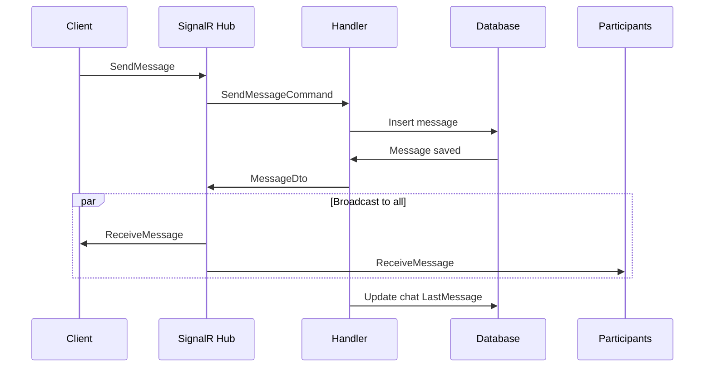
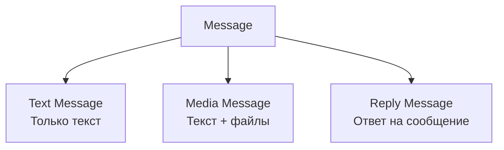

# Messages Module

**Назначение**: Отправка, получение и управление сообщениями

**Расположение**: `WhithinMessenger.Application/CommandsAndQueries/Messages/`

## MessageDto

```csharp
MessageDto {
  MessageId: Guid,
  ChatId: Guid,
  SenderId: Guid,
  SenderUsername: string,
  SenderAvatarUrl: string,
  Content: string,
  Timestamp: DateTime,
  IsEdited: bool,
  MediaFiles: MediaFileDto[],
  ReplyToMessageId: Guid?,
  ReplyToMessage: MessageDto?
}
```

## Commands

### SendMessageCommand

**Параметры**:
```csharp
SendMessageCommand {
  ChatId: Guid,
  SenderId: Guid,
  Content: string,
  MediaFileIds: Guid[],
  ReplyToMessageId: Guid?
}
```

**Возвращает**: `MessageDto`

**Валидация**:
- Content не пустой или есть медиафайлы
- Максимум 5000 символов
- Пользователь является участником чата

**Логика**:
1. Проверка прав доступа
2. Создание сообщения в БД
3. Связывание медиафайлов
4. Отправка через SignalR всем участникам
5. Обновление "последнее сообщение" в чате

---

### EditMessageCommand

**Параметры**:
```csharp
EditMessageCommand {
  MessageId: Guid,
  UserId: Guid,
  NewContent: string
}
```

**Возвращает**: `MessageDto`

**Ограничения**:
- Только автор может редактировать
- Только текст (медиафайлы нельзя изменить)
- Устанавливается флаг `IsEdited = true`

---

### DeleteMessageCommand

**Параметры**:
```csharp
DeleteMessageCommand {
  MessageId: Guid,
  UserId: Guid
}
```

**Возвращает**: `void`

**Права**:
- Автор сообщения
- Администратор чата/сервера

**Тип удаления**:
- Soft delete (помечается как удалённое)
- Content заменяется на "Сообщение удалено"

## Queries

### GetMessagesQuery

**Параметры**:
```csharp
GetMessagesQuery {
  ChatId: Guid,
  UserId: Guid,
  Page: int = 1,
  PageSize: int = 50
}
```

**Возвращает**:
```csharp
{
  Messages: MessageDto[],
  TotalCount: int,
  HasMore: bool
}
```

**Пагинация**:
- По умолчанию 50 сообщений
- Сортировка по убыванию времени (новые сверху)
- Поддержка бесконечной прокрутки

---

### GetMessageByIdQuery

**Параметры**:
```csharp
GetMessageByIdQuery {
  MessageId: Guid,
  UserId: Guid
}
```

**Возвращает**: `MessageDto`

**Использование**:
- Получение конкретного сообщения для ответа
- Навигация к упомянутому сообщению

## Процесс отправки сообщения



## Типы сообщений



## Медиафайлы в сообщениях

**Поддерживаемые типы**:
- Изображения (JPG, PNG, GIF, WEBP)
- Видео (MP4, WEBM)
- Аудио (MP3, WAV, OGG, M4A)
- Документы (PDF, DOC, DOCX, TXT, ZIP)

**Ограничения**:
- Максимум 10 файлов на сообщение
- Максимальный размер файла: 100MB

## Endpoints

**Send Message**: `SignalR Hub: SendMessage`
```json
{
  "chatId": "guid",
  "content": "string",
  "mediaFileIds": ["guid"],
  "replyToMessageId": "guid"
}
```

**Edit Message**: `PUT /api/messages/{messageId}`
```json
{
  "newContent": "string"
}
```

**Delete Message**: `DELETE /api/messages/{messageId}`

**Get Messages**: `GET /api/messages/{chatId}?page=1&pageSize=50`

**Get Message**: `GET /api/messages/message/{messageId}`

## SignalR Events

**ReceiveMessage**:
```json
{
  "messageId": "guid",
  "chatId": "guid",
  "senderId": "guid",
  "senderUsername": "string",
  "content": "string",
  "timestamp": "datetime",
  "mediaFiles": []
}
```

**MessageEdited**:
```json
{
  "messageId": "guid",
  "newContent": "string",
  "editedAt": "datetime"
}
```

**MessageDeleted**:
```json
{
  "messageId": "guid",
  "chatId": "guid"
}
```

## Поиск по сообщениям

**SearchMessagesQuery**:
```csharp
SearchMessagesQuery {
  ChatId: Guid,
  SearchTerm: string,
  UserId: Guid
}
```

**Возвращает**: Список сообщений с подсветкой найденного текста

**Особенности**:
- Full-text search по содержимому
- Поиск по имени отправителя
- Фильтр по дате

## Связанные модули

- **Chats Module** - информация о чате
- **Media Module** - загрузка файлов
- **Users Module** - информация об отправителе
- **Frontend**: `entities/message`

---

[← Назад к модулям](../README.md) | [Backend модули](./README.md)

