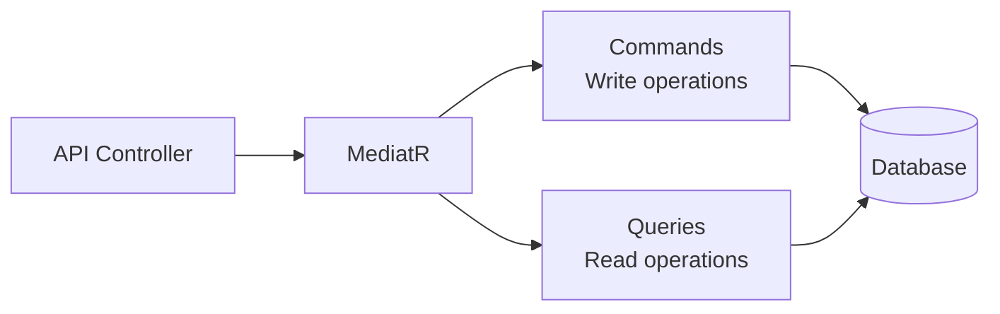

# Backend Modules

Backend модули построены на основе CQRS паттерна с использованием MediatR.

## Модули

| Модуль | Описание | Файл |
|--------|----------|------|
| **Auth** | Аутентификация и регистрация | [AUTH.md](./AUTH.md) |
| **Chats** | Управление чатами (приватные, групповые, серверные) | [CHATS.md](./CHATS.md) |
| **Friends** | Система друзей и заявок | [FRIENDS.md](./FRIENDS.md) |
| **Messages** | Отправка и управление сообщениями | [MESSAGES.md](./MESSAGES.md) |
| **Servers** | Серверы, категории, каналы | [SERVERS.md](./SERVERS.md) |
| **Media** | Загрузка и управление медиафайлами | [MEDIA.md](./MEDIA.md) |
| **Users** | Профили пользователей | [USERS.md](./USERS.md) |

## Структура модуля

Каждый модуль следует единому шаблону:

```
ModuleName/
├── CommandName/
│   ├── CommandName.cs
│   ├── CommandNameHandler.cs
│   └── CommandNameResult.cs
└── QueryName/
    ├── QueryName.cs
    ├── QueryNameHandler.cs
    └── QueryNameResult.cs
```

## CQRS Pattern



**Commands** - изменяют состояние:
- CreateXCommand
- UpdateXCommand
- DeleteXCommand

**Queries** - читают данные:
- GetXQuery
- SearchXQuery

## Расположение

`WhithinMessenger.Backend/src/WhithinMessenger.Application/CommandsAndQueries/`

---

[← Назад к модулям](../README.md)


