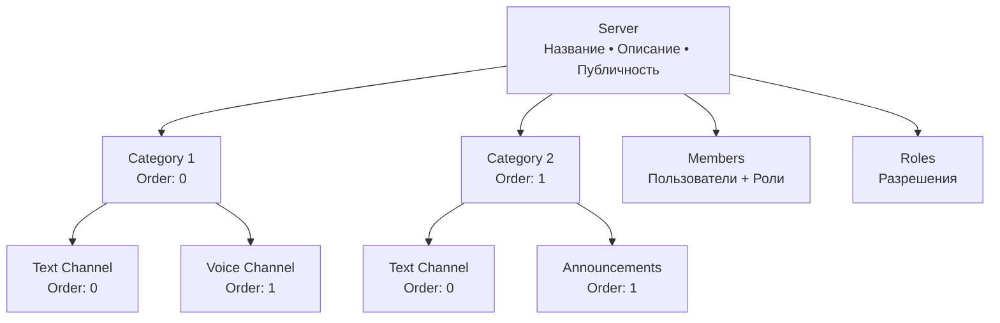
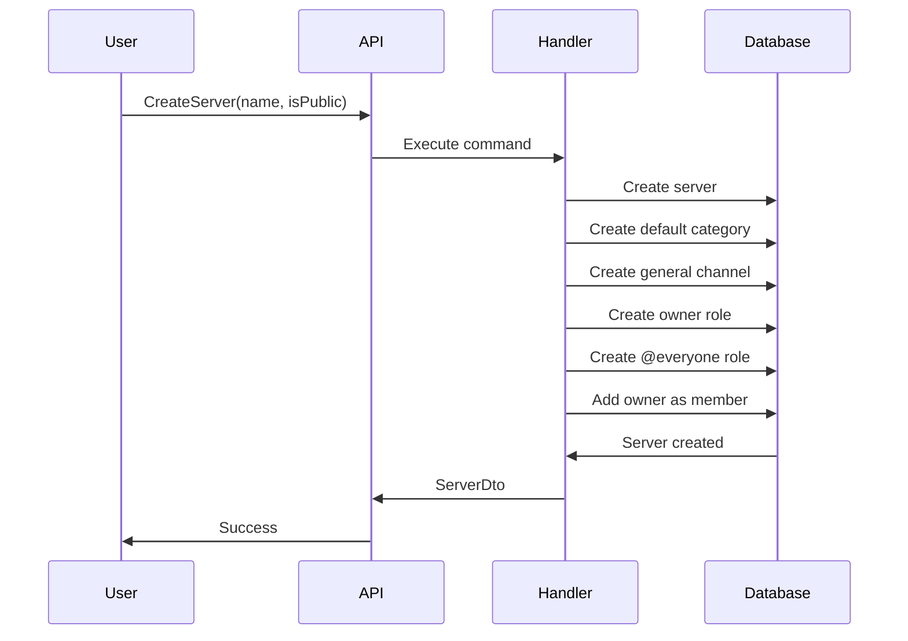

# Servers Module

**Назначение**: Управление серверами, категориями и каналами

**Расположение**: `WhithinMessenger.Application/CommandsAndQueries/Servers/`

## Структура сервера



## Commands

### CreateServerCommand

**Параметры**:
```csharp
CreateServerCommand {
  Name: string,
  OwnerId: Guid,
  Description: string?,
  IsPublic: bool,
  AvatarUrl: string?
}
```

**Возвращает**: `ServerDto { ServerId, Name, ... }`

**Автоматически создаётся**:
- Категория "Основное"
- Текстовый канал "общий"
- Роль "Владелец" для создателя
- Роль "@everyone" для всех участников

---

### DeleteServerCommand

**Параметры**:
```csharp
DeleteServerCommand {
  ServerId: Guid,
  OwnerId: Guid
}
```

**Права**: Только владелец сервера

**Логика**:
- Каскадное удаление всех каналов, категорий, ролей
- Удаление всех участников
- Soft delete сервера

---

### JoinServerCommand

**Параметры**:
```csharp
JoinServerCommand {
  ServerId: Guid,
  UserId: Guid
}
```

**Возвращает**: `JoinServerResult { Success }`

**Ограничения**:
- Только для публичных серверов
- Приватные серверы требуют инвайта

---

### LeaveServerCommand

**Параметры**:
```csharp
LeaveServerCommand {
  ServerId: Guid,
  UserId: Guid
}
```

**Ограничения**:
- Владелец не может покинуть (только удалить сервер)

---

### AddMemberCommand

**Параметры**:
```csharp
AddMemberCommand {
  ServerId: Guid,
  UserId: Guid,
  InvitedBy: Guid
}
```

**Права**: Требуется разрешение "Invite Members"

---

### CreateCategoryCommand

**Параметры**:
```csharp
CreateCategoryCommand {
  ServerId: Guid,
  Name: string,
  OrderIndex: int,
  IsPrivate: bool
}
```

**Возвращает**: `CategoryDto`

---

### CreateChatCommand (для каналов)

**Параметры**:
```csharp
CreateChatCommand {
  ServerId: Guid,
  CategoryId: Guid,
  Name: string,
  Type: ChatType,  // Text/Voice
  OrderIndex: int
}
```

**Возвращает**: `ChatDto`

---

### MoveCategoryCommand

**Параметры**:
```csharp
MoveCategoryCommand {
  CategoryId: Guid,
  NewOrderIndex: int
}
```

**Логика**: Изменяет порядок отображения категорий

---

### MoveChatCommand

**Параметры**:
```csharp
MoveChatCommand {
  ChatId: Guid,
  NewCategoryId: Guid?,
  NewOrderIndex: int
}
```

**Логика**: Перемещает канал между категориями или изменяет порядок

## Queries

### GetUserServersQuery

**Параметры**:
```csharp
GetUserServersQuery {
  UserId: Guid
}
```

**Возвращает**:
```csharp
ServerDto[] {
  ServerId,
  Name,
  AvatarUrl,
  IsOwner,
  UnreadCount
}
```

---

### GetPublicServersQuery

**Параметры**:
```csharp
GetPublicServersQuery {
  SearchTerm: string?,
  Page: int,
  PageSize: int
}
```

**Возвращает**: Список публичных серверов для присоединения

---

### GetServerQuery

**Параметры**:
```csharp
GetServerQuery {
  ServerId: Guid,
  UserId: Guid
}
```

**Возвращает**:
```csharp
ServerDetailDto {
  ServerId,
  Name,
  Description,
  AvatarUrl,
  OwnerId,
  MembersCount,
  Categories[] {
    CategoryId,
    Name,
    OrderIndex,
    Chats[] {
      ChatId,
      Name,
      Type,
      OrderIndex
    }
  }
}
```

---

### GetServerMembersQuery

**Параметры**:
```csharp
GetServerMembersQuery {
  ServerId: Guid
}
```

**Возвращает**:
```csharp
MemberDto[] {
  UserId,
  Username,
  AvatarUrl,
  Roles[],
  JoinedAt,
  Status
}
```

## Роли и разрешения

**Системные роли**:
- `@everyone` - базовая роль для всех участников
- `Owner` - владелец сервера (все права)
- `Administrator` - полные права (кроме удаления сервера)

**Разрешения**:
```csharp
enum ServerPermission {
  ManageServer,      // Управление настройками
  ManageChannels,    // Создание/удаление каналов
  ManageRoles,       // Управление ролями
  InviteMembers,     // Приглашение участников
  KickMembers,       // Кик участников
  BanMembers,        // Бан участников
  ManageMessages,    // Удаление сообщений
  SendMessages,      // Отправка сообщений
  AttachFiles,       // Прикрепление файлов
  MentionEveryone    // Упоминание @everyone
}
```

## Процесс создания сервера



## Endpoints

**Create Server**: `POST /api/servers`
```json
{
  "name": "string",
  "description": "string",
  "isPublic": true
}
```

**Delete Server**: `DELETE /api/servers/{serverId}`

**Join Server**: `POST /api/servers/{serverId}/join`

**Leave Server**: `POST /api/servers/{serverId}/leave`

**Get User Servers**: `GET /api/servers`

**Get Public Servers**: `GET /api/servers/public?search=term&page=1`

**Get Server Details**: `GET /api/servers/{serverId}`

**Get Members**: `GET /api/servers/{serverId}/members`

**Create Category**: `POST /api/servers/{serverId}/categories`
```json
{
  "name": "string",
  "isPrivate": false
}
```

**Create Channel**: `POST /api/servers/{serverId}/chats`
```json
{
  "categoryId": "guid",
  "name": "string",
  "type": 1
}
```

**Move Category**: `PUT /api/servers/categories/{categoryId}/move`
```json
{
  "newOrderIndex": 2
}
```

**Move Channel**: `PUT /api/servers/chats/{chatId}/move`
```json
{
  "newCategoryId": "guid",
  "newOrderIndex": 1
}
```

## SignalR Events (ServerHub)

**ServerCreated**: Уведомление о создании сервера

**ServerDeleted**: Сервер удалён

**MemberJoined**: Новый участник присоединился
```json
{
  "serverId": "guid",
  "userId": "guid",
  "username": "string"
}
```

**MemberLeft**: Участник покинул сервер

**CategoryCreated**: Создана категория

**ChannelCreated**: Создан канал

**CategoryMoved**: Изменён порядок категорий

**ChannelMoved**: Канал перемещён

## База данных

**Таблица Server**:
```sql
CREATE TABLE Server (
  Id UUID PRIMARY KEY,
  Name VARCHAR(100) NOT NULL,
  Description TEXT,
  OwnerId UUID NOT NULL,
  IsPublic BOOLEAN DEFAULT true,
  AvatarUrl VARCHAR(500),
  CreatedAt TIMESTAMP,
  FOREIGN KEY (OwnerId) REFERENCES Users(Id)
);
```

**Таблица ChatCategory**:
```sql
CREATE TABLE ChatCategory (
  Id UUID PRIMARY KEY,
  ServerId UUID NOT NULL,
  Name VARCHAR(100) NOT NULL,
  OrderIndex INT NOT NULL,
  IsPrivate BOOLEAN DEFAULT false,
  FOREIGN KEY (ServerId) REFERENCES Server(Id)
);
```

**Индексы**:
- `IX_Server_OwnerId`
- `IX_Server_IsPublic`
- `IX_ChatCategory_ServerId`

## Связанные модули

- **Chats Module** - каналы сервера
- **Members Module** - участники сервера
- **Roles Module** - роли и разрешения
- **Messages Module** - сообщения в каналах
- **Frontend**: `entities/server`

---

[← Назад к модулям](../README.md) | [Backend модули](./README.md)


