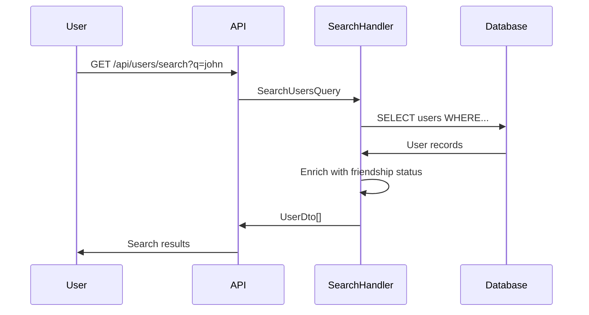

# Users Module

**Назначение**: Управление профилями пользователей

**Расположение**: `WhithinMessenger.Application/CommandsAndQueries/Users/`

## Queries

### SearchUsersQuery

**Параметры**:
```csharp
SearchUsersQuery {
  SearchTerm: string,
  CurrentUserId: Guid,
  Page: int = 1,
  PageSize: int = 20
}
```

**Возвращает**:
```csharp
SearchUsersResult {
  Users: UserDto[] {
    UserId,
    Username,
    AvatarUrl,
    IsFriend,
    HasPendingRequest
  },
  TotalCount: int
}
```

**Логика поиска**:
- По username (частичное совпадение)
- Исключает текущего пользователя
- Сортировка: друзья сверху

---

### GetUserProfileQuery

**Параметры**:
```csharp
GetUserProfileQuery {
  UserId: Guid,
  RequestedBy: Guid
}
```

**Возвращает**:
```csharp
UserProfileDto {
  UserId: Guid,
  Username: string,
  AvatarUrl: string,
  Bio: string,
  CreatedAt: DateTime,
  IsFriend: bool,
  MutualFriendsCount: int,
  MutualServersCount: int
}
```

## UserDto

```csharp
public class UserDto {
  public Guid UserId { get; set; }
  public string Username { get; set; }
  public string AvatarUrl { get; set; }
}
```

## Профиль пользователя

**UserProfile (Domain Model)**:
```csharp
public class UserProfile {
  public Guid Id { get; set; }
  public Guid UserId { get; set; }
  public string Bio { get; set; }
  public string AvatarUrl { get; set; }
  
  // Navigation
  public ApplicationUser User { get; set; }
}
```

## Commands (опционально)

### UpdateUserProfileCommand

**Параметры**:
```csharp
UpdateUserProfileCommand {
  UserId: Guid,
  Bio: string?,
  AvatarUrl: string?
}
```

**Возвращает**: `UserProfileDto`

## Endpoints

**Search Users**: `GET /api/users/search?q=term&page=1`

**Get User Profile**: `GET /api/users/{userId}`

**Get Current User**: `GET /api/users/me`

**Update Profile**: `PUT /api/users/me`
```json
{
  "bio": "string",
  "avatarUrl": "string"
}
```

## Процесс поиска пользователей



## Аватары

**Генерация дефолтных аватаров**:
- Используется класс `AvatarColorGenerator` из Domain
- Генерируется цвет на основе username
- Инициалы на цветном фоне

**Кастомные аватары**:
- Загрузка через Media Module
- Максимальный размер: 5 MB
- Форматы: JPG, PNG, WEBP
- Автоматическое сжатие до 512x512px

## База данных

**Таблица ApplicationUser**:
```sql
CREATE TABLE ApplicationUser (
  Id UUID PRIMARY KEY,
  Username VARCHAR(20) UNIQUE NOT NULL,
  Email VARCHAR(255) UNIQUE NOT NULL,
  PasswordHash VARCHAR(255) NOT NULL,
  CreatedAt TIMESTAMP DEFAULT NOW()
);
```

**Таблица UserProfile**:
```sql
CREATE TABLE UserProfile (
  Id UUID PRIMARY KEY,
  UserId UUID UNIQUE NOT NULL,
  Bio TEXT,
  AvatarUrl VARCHAR(500),
  FOREIGN KEY (UserId) REFERENCES ApplicationUser(Id)
);
```

**Индексы**:
- `IX_ApplicationUser_Username`
- `IX_ApplicationUser_Email`
- `IX_UserProfile_UserId`

## Связанные модули

- **Auth Module** - создание пользователя при регистрации
- **Friends Module** - информация о друзьях
- **Chats Module** - участники чатов
- **Media Module** - загрузка аватаров
- **Frontend**: `entities/user`, `shared/hooks/useUser`

---

[← Назад к модулям](../README.md) | [Backend модули](./README.md)

