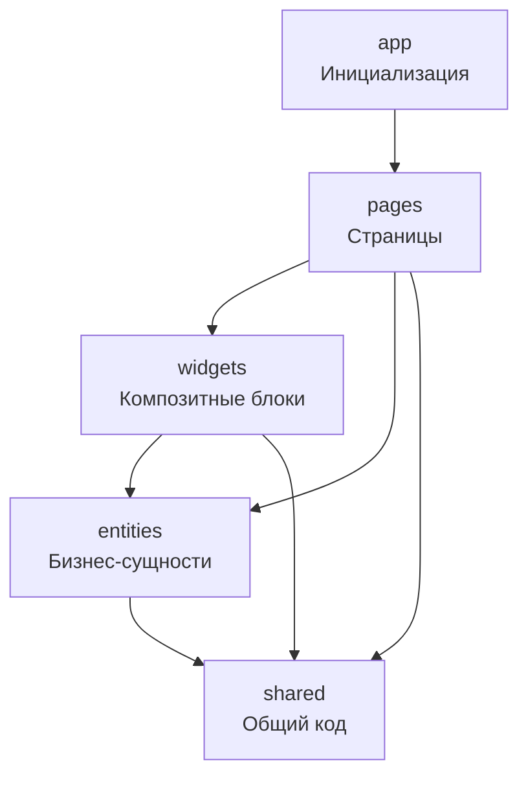

# Frontend Modules

Frontend модули построены на основе Feature-Sliced Design архитектуры.

## Слои

| Слой | Описание | Файл |
|------|----------|------|
| **Entities** | Бизнес-сущности (chat, friend, message, server, member, user) | [ENTITIES.md](./ENTITIES.md) |
| **Widgets** | Композиционные UI блоки (11 widgets) | [WIDGETS.md](./WIDGETS.md) |
| **Shared** | Переиспользуемый код (UI, hooks, contexts, utils) | [SHARED.md](./SHARED.md) |

## Feature-Sliced Design

## Правило зависимостей

- `app` → `pages` → `widgets` → `entities` → `shared`
- Нельзя импортировать из верхних слоёв в нижние
- Можно импортировать из нижних слоёв в верхние

## Entities (6 модулей)

- **chat** - управление чатами
- **friend** - система друзей
- **message** - сообщения
- **server** - серверы
- **member** - участники сервера
- **user** - профили пользователей

## Widgets (11 модулей)

- **chat-list** - список чатов
- **chat-room** - комната чата
- **friends-panel** - панель друзей
- **friends-list** - список друзей
- **friend-requests** - заявки в друзья
- **server-list** - список серверов
- **server-discovery** - поиск серверов
- **server-panel** - панель сервера
- **categories-list** - категории и каналы
- **member-management** - управление участниками
- **server-settings** - настройки сервера

## Shared

- **UI Components** (Atomic Design):
  - Atoms: Button, FormField, MessageInput, UserAvatar, ServerIcon
  - Molecules: MessageItem, FriendItem, SearchBar, ContextMenu, MediaUpload
  - Organisms: LoginForm, RegisterForm, SettingsModal

- **Lib**:
  - API: apiClient, authApi
  - Contexts: AuthContext, ConnectionContext, ServerContext
  - Hooks: useAuth, useDebounce, useContextMenu, useChatRoom
  - Utils: audioAnalyzer, waveformGenerator

## Расположение

`WhithinMessenger.Client/src/`

---

[← Назад к модулям](../README.md)

