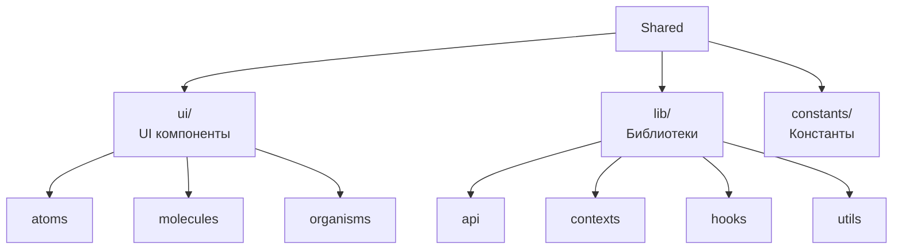

# Frontend Shared

**Слой**: Shared (переиспользуемый код)

**Назначение**: Общий код для всего приложения

**Расположение**: `WhithinMessenger.Client/src/shared/`

## Структура



---

## UI Components (Atomic Design)

### Atoms (Базовые компоненты)

#### Button (`ui/atoms/Button`)

```jsx
export const Button = ({ 
  children, 
  variant = 'primary',  // primary | secondary | danger
  size = 'medium',      // small | medium | large
  disabled = false,
  onClick 
}) => {
  return (
    <button 
      className={`button button--${variant} button--${size}`}
      disabled={disabled}
      onClick={onClick}
    >
      {children}
    </button>
  );
};
```

**Варианты**:
- `primary` - основная кнопка
- `secondary` - вторичная кнопка
- `danger` - опасное действие (удаление)
- `ghost` - прозрачная кнопка

---

#### FormField (`ui/atoms/FormField`)

```jsx
export const FormField = ({
  label,
  name,
  type = 'text',
  value,
  onChange,
  error,
  placeholder
}) => {
  return (
    <div className="form-field">
      <label htmlFor={name}>{label}</label>
      <input
        id={name}
        name={name}
        type={type}
        value={value}
        onChange={(e) => onChange(e.target.value)}
        placeholder={placeholder}
        className={error ? 'error' : ''}
      />
      {error && <span className="error-message">{error}</span>}
    </div>
  );
};
```

---

#### MessageInput (`ui/atoms/MessageInput`)

```jsx
export const MessageInput = ({ onSend, placeholder = 'Введите сообщение...' }) => {
  const [message, setMessage] = useState('');
  
  const handleSubmit = (e) => {
    e.preventDefault();
    if (message.trim()) {
      onSend(message);
      setMessage('');
    }
  };
  
  return (
    <form className="message-input" onSubmit={handleSubmit}>
      <textarea
        value={message}
        onChange={(e) => setMessage(e.target.value)}
        placeholder={placeholder}
        rows={1}
      />
      <button type="submit">Отправить</button>
    </form>
  );
};
```

---

#### UserAvatar (`ui/atoms/UserAvatar`)

```jsx
export const UserAvatar = ({ 
  user, 
  size = 40
}) => {
  return (
    <div className="user-avatar" style={{ width: size, height: size }}>
      {user.avatarUrl ? (
        
      ) : (
        <div className="avatar-placeholder">
          {user.username.charAt(0).toUpperCase()}
        </div>
      )}
    </div>
  );
};
```

---

#### ServerIcon (`ui/atoms/ServerIcon`)

```jsx
export const ServerIcon = ({ server, onClick }) => {
  return (
    <div className="server-icon" onClick={onClick}>
      {server.avatarUrl ? (
        
      ) : (
        <div className="icon-placeholder">
          {server.name.substring(0, 2).toUpperCase()}
        </div>
      )}
    </div>
  );
};
```

---

### Molecules (Композиции)

#### MessageItem (`ui/molecules/MessageItem`)

```jsx
export const MessageItem = ({ 
  message, 
  currentUserId,
  onEdit, 
  onDelete,
  onReply 
}) => {
  const [showMenu, setShowMenu] = useState(false);
  const isOwn = message.senderId === currentUserId;
  
  return (
    <div className={`message-item ${isOwn ? 'own' : ''}`}>
      <UserAvatar user={message.sender} size={32} />
      
      <div className="message-content">
        <div className="message-header">
          <span className="username">{message.senderUsername}</span>
          <span className="timestamp">{formatTime(message.timestamp)}</span>
        </div>
        
        <div className="message-text">
          {message.content}
          {message.isEdited && <span className="edited">(изменено)</span>}
        </div>
        
        {message.mediaFiles?.length > 0 && (
          <div className="attachments">
            {message.mediaFiles.map(file => (
              <MediaFile key={file.id} file={file} />
            ))}
          </div>
        )}
      </div>
      
      <ContextMenu
        visible={showMenu}
        items={[
          { label: 'Ответить', onClick: () => onReply(message) },
          isOwn && { label: 'Редактировать', onClick: () => onEdit(message) },
          isOwn && { label: 'Удалить', onClick: () => onDelete(message.id) }
        ].filter(Boolean)}
      />
    </div>
  );
};
```

---

#### FriendItem (`ui/molecules/FriendItem`)

```jsx
export const FriendItem = ({ friend, onRemove, onMessage }) => {
  return (
    <div className="friend-item">
      <UserAvatar user={friend} />
      
      <div className="friend-info">
        <span className="username">{friend.username}</span>
      </div>
      
      <div className="actions">
        <button onClick={() => onMessage(friend.id)}>Написать</button>
        <button onClick={() => onRemove(friend.id)}>Удалить</button>
      </div>
    </div>
  );
};
```

---

#### SearchBar (`ui/molecules/SearchBar`)

```jsx
export const SearchBar = ({ 
  value, 
  onChange, 
  placeholder = 'Поиск...' 
}) => {
  return (
    <div className="search-bar">
      <input
        type="text"
        value={value}
        onChange={(e) => onChange(e.target.value)}
        placeholder={placeholder}
      />
      <SearchIcon />
    </div>
  );
};
```

---

#### ContextMenu (`ui/molecules/ContextMenu`)

```jsx
export const ContextMenu = ({ visible, items, position }) => {
  if (!visible) return null;
  
  return (
    <div 
      className="context-menu" 
      style={{ top: position.y, left: position.x }}
    >
      {items.map((item, index) => (
        <div 
          key={index}
          className="menu-item"
          onClick={item.onClick}
        >
          {item.icon && <span className="icon">{item.icon}</span>}
          <span>{item.label}</span>
        </div>
      ))}
    </div>
  );
};
```

---

#### MediaUpload (`ui/molecules/MediaUpload`)

```jsx
export const MediaUpload = ({ onUpload, maxFiles = 10 }) => {
  const [files, setFiles] = useState([]);
  const inputRef = useRef(null);
  
  const handleFileChange = (e) => {
    const newFiles = Array.from(e.target.files);
    if (files.length + newFiles.length > maxFiles) {
      alert(`Максимум ${maxFiles} файлов`);
      return;
    }
    setFiles([...files, ...newFiles]);
  };
  
  const handleUpload = async () => {
    const uploadedFiles = await Promise.all(
      files.map(file => uploadFile(file))
    );
    onUpload(uploadedFiles);
    setFiles([]);
  };
  
  return (
    <div className="media-upload">
      <input
        ref={inputRef}
        type="file"
        multiple
        onChange={handleFileChange}
        style={{ display: 'none' }}
      />
      <button onClick={() => inputRef.current.click()}>
        Выбрать файлы
      </button>
      
      {files.length > 0 && (
        <div className="preview">
          {files.map((file, index) => (
            <div key={index} className="file-preview">
              {file.name}
              <button onClick={() => removeFile(index)}>×</button>
            </div>
          ))}
          <button onClick={handleUpload}>Загрузить</button>
        </div>
      )}
    </div>
  );
};
```

---

### Organisms (Сложные блоки)

#### LoginForm (`ui/organisms/LoginForm`)

```jsx
import { useState } from 'react';
import { useAuth } from '@/shared/lib/hooks';
import { FormField } from '@/shared/ui/atoms';
import { Button } from '@/shared/ui/atoms';

export const LoginForm = () => {
  const [username, setUsername] = useState('');
  const [password, setPassword] = useState('');
  const [errors, setErrors] = useState({});
  const { login, loading } = useAuth();
  
  const handleSubmit = async (e) => {
    e.preventDefault();
    
    // Валидация
    const newErrors = {};
    if (!username) newErrors.username = 'Введите username';
    if (!password) newErrors.password = 'Введите пароль';
    
    if (Object.keys(newErrors).length > 0) {
      setErrors(newErrors);
      return;
    }
    
    await login(username, password);
  };
  
  return (
    <form className="login-form" onSubmit={handleSubmit}>
      <h2>Вход</h2>
      
      <FormField
        label="Username"
        name="username"
        value={username}
        onChange={setUsername}
        error={errors.username}
      />
      
      <FormField
        label="Пароль"
        name="password"
        type="password"
        value={password}
        onChange={setPassword}
        error={errors.password}
      />
      
      <Button type="submit" disabled={loading}>
        {loading ? 'Загрузка...' : 'Войти'}
      </Button>
    </form>
  );
};
```

---

## Lib (Библиотеки)

### API (`lib/api/`)

#### apiClient.js

```javascript
import axios from 'axios';

const API_BASE_URL = import.meta.env.VITE_API_URL || 'https://localhost:5117';

export const apiClient = axios.create({
  baseURL: `${API_BASE_URL}/api`,
  headers: {
    'Content-Type': 'application/json'
  }
});

// Interceptor для обработки ошибок
apiClient.interceptors.response.use(
  (response) => response.data,
  (error) => {
    if (error.response?.status === 404) {
      // Ресурс не найден
    }
    return Promise.reject(error);
  }
);
```

---

### Contexts (`lib/contexts/`)

#### AuthContext.jsx

```jsx
import { createContext, useState, useEffect } from 'react';
import { authApi } from '@/shared/lib/api';

export const AuthContext = createContext(null);

export const AuthProvider = ({ children }) => {
  const [user, setUser] = useState(null);
  const [loading, setLoading] = useState(true);
  
  useEffect(() => {
    checkAuth();
  }, []);
  
  const checkAuth = async () => {
    try {
      const userData = await authApi.getCurrentUser();
      setUser(userData);
    } catch (error) {
      setUser(null);
    }
    setLoading(false);
  };
  
  const login = async (username, password) => {
    const response = await authApi.login(username, password);
    setUser(response.user);
  };
  
  const logout = () => {
    setUser(null);
  };
  
  return (
    <AuthContext.Provider value={{ user, loading, login, logout }}>
      {children}
    </AuthContext.Provider>
  );
};
```

---

#### ConnectionContext.jsx (SignalR)

```jsx
import { createContext, useState, useEffect } from 'react';
import * as signalR from '@microsoft/signalr';

export const ConnectionContext = createContext(null);

export const ConnectionProvider = ({ children }) => {
  const [connection, setConnection] = useState(null);
  const [connected, setConnected] = useState(false);
  
  useEffect(() => {
    const newConnection = new signalR.HubConnectionBuilder()
      .withUrl('https://localhost:5117/groupchathub')
      .withAutomaticReconnect()
      .build();
    
    newConnection.start()
      .then(() => {
        console.log('SignalR connected');
        setConnected(true);
      })
      .catch(err => console.error('SignalR connection error:', err));
    
    setConnection(newConnection);
    
    return () => {
      newConnection.stop();
    };
  }, []);
  
  return (
    <ConnectionContext.Provider value={{ connection, connected }}>
      {children}
    </ConnectionContext.Provider>
  );
};
```

---

### Hooks (`lib/hooks/`)

#### useAuth.js

```javascript
import { useContext } from 'react';
import { AuthContext } from '@/shared/lib/contexts';

export const useAuth = () => {
  const context = useContext(AuthContext);
  if (!context) {
    throw new Error('useAuth must be used within AuthProvider');
  }
  return context;
};
```

---

#### useDebounce.js

```javascript
import { useState, useEffect } from 'react';

export const useDebounce = (value, delay = 500) => {
  const [debouncedValue, setDebouncedValue] = useState(value);
  
  useEffect(() => {
    const timer = setTimeout(() => {
      setDebouncedValue(value);
    }, delay);
    
    return () => clearTimeout(timer);
  }, [value, delay]);
  
  return debouncedValue;
};
```

---

#### useContextMenu.js

```javascript
import { useState, useCallback } from 'react';

export const useContextMenu = () => {
  const [visible, setVisible] = useState(false);
  const [position, setPosition] = useState({ x: 0, y: 0 });
  
  const show = useCallback((e) => {
    e.preventDefault();
    setPosition({ x: e.clientX, y: e.clientY });
    setVisible(true);
  }, []);
  
  const hide = useCallback(() => {
    setVisible(false);
  }, []);
  
  return { visible, position, show, hide };
};
```

---

### Utils (`lib/utils/`)

#### audioAnalyzer.js

```javascript
export class AudioAnalyzer {
  constructor(audioElement) {
    this.audioContext = new AudioContext();
    this.source = this.audioContext.createMediaElementSource(audioElement);
    this.analyzer = this.audioContext.createAnalyser();
    
    this.source.connect(this.analyzer);
    this.analyzer.connect(this.audioContext.destination);
    
    this.analyzer.fftSize = 2048;
    this.dataArray = new Uint8Array(this.analyzer.frequencyBinCount);
  }
  
  getFrequencyData() {
    this.analyzer.getByteFrequencyData(this.dataArray);
    return this.dataArray;
  }
  
  getWaveform() {
    this.analyzer.getByteTimeDomainData(this.dataArray);
    return this.dataArray;
  }
}
```

---

## Constants (`constants/`)

```javascript
// constants/chatTypes.js
export const CHAT_TYPES = {
  PRIVATE: 1,
  GROUP: 2,
  SERVER: 3
};
```

---

## Использование

```jsx
// В компоненте
import { Button } from '@/shared/ui/atoms';
import { MessageItem } from '@/shared/ui/molecules';
import { useAuth } from '@/shared/lib/hooks';
import { apiClient } from '@/shared/lib/api';

function MyComponent() {
  const { user } = useAuth();
  
  return (
    <div>
      <Button onClick={handleClick}>Кликни</Button>
      <MessageItem message={message} />
    </div>
  );
}
```

---

[← Назад к модулям](../README.md) | [Frontend модули](./README.md)

