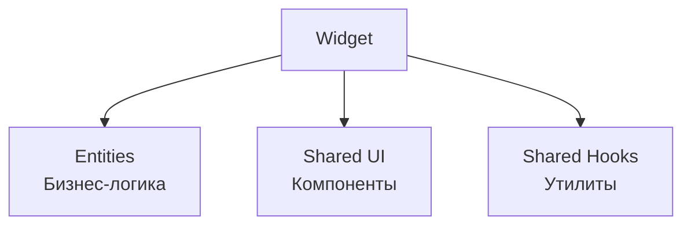

# Frontend Widgets

**Слой**: Widgets (композиционные блоки)

**Назначение**: Сборка UI из entities и shared компонентов

**Расположение**: `WhithinMessenger.Client/src/widgets/`

## Структура Widget

```
widget-name/
├── ui/
│   ├── WidgetName.jsx
│   ├── WidgetName.css
│   └── index.js
└── index.js
```

## Архитектура



---

## 1. chat-list

**Назначение**: Список чатов пользователя

**Использует**:
- `entities/chat` (API, hooks)
- `shared/ui/atoms/UserAvatar`
- `shared/ui/molecules/SearchBar`

**Компонент**:
```jsx
import { useChatList } from '@/entities/chat';
import { SearchBar } from '@/shared/ui/molecules';

export const ChatList = () => {
  const { chats, loading } = useChatList();
  const [searchTerm, setSearchTerm] = useState('');
  
  const filteredChats = chats.filter(chat => 
    chat.name.toLowerCase().includes(searchTerm.toLowerCase())
  );
  
  return (
    <div className="chat-list">
      <SearchBar value={searchTerm} onChange={setSearchTerm} />
      {filteredChats.map(chat => (
        <ChatItem key={chat.id} chat={chat} />
      ))}
    </div>
  );
};
```

**Функции**:
- Отображение всех чатов
- Поиск по названию
- Последнее сообщение
- Сортировка по времени

---

## 2. chat-room

**Назначение**: Комната чата с сообщениями и вводом

**Использует**:
- `entities/message` (API)
- `entities/chat` (информация о чате)
- `shared/ui/molecules/MessageItem`
- `shared/ui/atoms/MessageInput`
- `shared/hooks/useChatRoom`

**Компонент**:
```jsx
import { useChatRoom } from '@/shared/lib/hooks';
import { MessageItem } from '@/shared/ui/molecules';
import { MessageInput } from '@/shared/ui/atoms';

export const ChatRoom = ({ chatId }) => {
  const {
    messages,
    loading,
    sendMessage,
    editMessage,
    deleteMessage
  } = useChatRoom(chatId);
  
  return (
    <div className="chat-room">
      <div className="messages">
        {messages.map(msg => (
          <MessageItem 
            key={msg.id} 
            message={msg}
            onEdit={editMessage}
            onDelete={deleteMessage}
          />
        ))}
      </div>
      <MessageInput onSend={sendMessage} />
    </div>
  );
};
```

**Функции**:
- Отображение сообщений
- Отправка сообщений
- Редактирование/удаление
- Прикрепление файлов
- Ответы на сообщения
- Автоскролл к новым сообщениям

---

## 3. friends-panel

**Назначение**: Панель управления друзьями

**Использует**:
- `widgets/friends-list`
- `widgets/friend-requests`
- `shared/ui/molecules/AddFriendModal`

**Компонент**:
```jsx
export const FriendsPanel = () => {
  const [activeTab, setActiveTab] = useState('friends'); // 'friends' | 'requests'
  const [showAddModal, setShowAddModal] = useState(false);
  
  return (
    <div className="friends-panel">
      <div className="tabs">
        <button onClick={() => setActiveTab('friends')}>Друзья</button>
        <button onClick={() => setActiveTab('requests')}>Заявки</button>
        <button onClick={() => setShowAddModal(true)}>Добавить</button>
      </div>
      
      {activeTab === 'friends' ? <FriendsList /> : <FriendRequests />}
      
      {showAddModal && <AddFriendModal onClose={() => setShowAddModal(false)} />}
    </div>
  );
};
```

**Функции**:
- Переключение между друзьями и заявками
- Добавление друзей

---

## 4. friends-list

**Назначение**: Список друзей

**Использует**:
- `entities/friend` (hooks)
- `shared/ui/molecules/FriendItem`

**Компонент**:
```jsx
import { useFriends } from '@/entities/friend';
import { FriendItem } from '@/shared/ui/molecules';

export const FriendsList = () => {
  const { friends, loading, removeFriend } = useFriends();
  
  return (
    <div className="friends-list">
      {friends.map(friend => (
        <FriendItem 
          key={friend.id}
          friend={friend}
          onRemove={removeFriend}
        />
      ))}
    </div>
  );
};
```

**Функции**:
- Отображение друзей
- Удаление из друзей
- Открытие чата

---

## 5. friend-requests

**Назначение**: Список заявок в друзья

**Использует**:
- `entities/friend` (hooks)
- `shared/ui/molecules/FriendRequestItem`

**Компонент**:
```jsx
import { useFriendRequests } from '@/entities/friend';
import { FriendRequestItem } from '@/shared/ui/molecules';

export const FriendRequests = () => {
  const { requests, accept, decline } = useFriendRequests();
  
  return (
    <div className="friend-requests">
      {requests.map(request => (
        <FriendRequestItem
          key={request.id}
          request={request}
          onAccept={accept}
          onDecline={decline}
        />
      ))}
    </div>
  );
};
```

**Функции**:
- Входящие заявки
- Принятие/отклонение

---

## 6. server-list

**Назначение**: Список серверов пользователя

**Использует**:
- `entities/server` (hooks)
- `shared/ui/atoms/ServerIcon`

**Компонент**:
```jsx
import { useServers } from '@/entities/server';
import { ServerIcon } from '@/shared/ui/atoms';

export const ServerList = () => {
  const { servers, loading } = useServers();
  const navigate = useNavigate();
  
  return (
    <div className="server-list">
      {servers.map(server => (
        <ServerIcon
          key={server.id}
          server={server}
          onClick={() => navigate(`/servers/${server.id}`)}
        />
      ))}
    </div>
  );
};
```

**Функции**:
- Иконки серверов
- Навигация к серверу
- Порядок серверов (drag & drop)

---

## 7. server-discovery

**Назначение**: Поиск публичных серверов

**Использует**:
- `entities/server` (API)
- `shared/ui/molecules/SearchBar`

**Компонент**:
```jsx
import { serverApi } from '@/entities/server';
import { SearchBar } from '@/shared/ui/molecules';

export const ServerDiscovery = () => {
  const [servers, setServers] = useState([]);
  const [searchTerm, setSearchTerm] = useState('');
  
  const handleSearch = async (term) => {
    const results = await serverApi.getPublicServers(term);
    setServers(results);
  };
  
  const handleJoin = async (serverId) => {
    await serverApi.joinServer(serverId);
    // Обновить список серверов пользователя
  };
  
  return (
    <div className="server-discovery">
      <SearchBar value={searchTerm} onChange={handleSearch} />
      <div className="servers-grid">
        {servers.map(server => (
          <ServerCard
            key={server.id}
            server={server}
            onJoin={handleJoin}
          />
        ))}
      </div>
    </div>
  );
};
```

**Функции**:
- Поиск серверов
- Предпросмотр информации
- Присоединение к серверу

---

## 8. server-panel

**Назначение**: Боковая панель сервера

**Использует**:
- `entities/server` (hooks)
- `widgets/categories-list`

**Компонент**:
```jsx
import { useServer } from '@/entities/server';
import { CategoriesList } from '@/widgets/categories-list';

export const ServerPanel = ({ serverId }) => {
  const { server, categories } = useServer(serverId);
  
  return (
    <div className="server-panel">
      <div className="server-header">
        <h2>{server?.name}</h2>
      </div>
      <CategoriesList serverId={serverId} categories={categories} />
    </div>
  );
};
```

**Функции**:
- Название сервера
- Список категорий и каналов
- Навигация по каналам

---

## 9. categories-list

**Назначение**: Список категорий и каналов сервера

**Использует**:
- `entities/server`
- `shared/ui/molecules/CategoryItem`
- `shared/ui/molecules/ChannelItem`

**Компонент**:
```jsx
import { CategoryItem } from '@/shared/ui/molecules';

export const CategoriesList = ({ serverId, categories }) => {
  return (
    <div className="categories-list">
      {categories.map(category => (
        <div key={category.id}>
          <CategoryItem category={category} />
          <div className="channels">
            {category.chats.map(channel => (
              <ChannelItem key={channel.id} channel={channel} />
            ))}
          </div>
        </div>
      ))}
    </div>
  );
};
```

**Функции**:
- Сворачивание/разворачивание категорий
- Список каналов
- Контекстное меню (создать, редактировать, удалить)

---

## 10. member-management

**Назначение**: Управление участниками сервера

**Использует**:
- `entities/member` (hooks)

**Компонент**:
```jsx
import { useMembers } from '@/entities/member';

export const MemberManagement = ({ serverId }) => {
  const { members, addMember, removeMember } = useMembers(serverId);
  
  return (
    <div className="member-management">
      <h3>Участники ({members.length})</h3>
      <button onClick={() => setShowAddModal(true)}>Добавить</button>
      
      {members.map(member => (
        <div key={member.userId} className="member-item">
          <UserAvatar user={member} />
          <span>{member.username}</span>
          <button onClick={() => removeMember(member.userId)}>Удалить</button>
        </div>
      ))}
    </div>
  );
};
```

**Функции**:
- Список участников
- Добавление/удаление

---

## 11. server-settings

**Назначение**: Настройки сервера

**Использует**:
- `entities/server`
- `widgets/member-management`

**Компонент**:
```jsx
export const ServerSettings = ({ serverId }) => {
  const [activeTab, setActiveTab] = useState('general');
  
  return (
    <div className="server-settings">
      <div className="tabs">
        <button onClick={() => setActiveTab('general')}>Общие</button>
        <button onClick={() => setActiveTab('members')}>Участники</button>
      </div>
      
      <div className="content">
        {activeTab === 'general' && <GeneralSettings serverId={serverId} />}
        {activeTab === 'members' && <MemberManagement serverId={serverId} />}
      </div>
    </div>
  );
};
```

**Функции**:
- Вкладки настроек
- Общие настройки (название, описание, аватар)
- Управление участниками
- Удаление сервера

---

## Общие паттерны

### 1. Композиция

Widgets комбинируют entities и shared компоненты:

```jsx
import { useChatList } from '@/entities/chat';
import { SearchBar } from '@/shared/ui/molecules';
import { UserAvatar } from '@/shared/ui/atoms';

export const ChatList = () => {
  const { chats } = useChatList();
  
  return (
    <div>
      <SearchBar />
      {chats.map(chat => (
        <div>
          <UserAvatar user={chat.user} />
          <span>{chat.name}</span>
        </div>
      ))}
    </div>
  );
};
```

### 2. Правило зависимостей

Widgets могут использовать:
- ✅ entities
- ✅ shared
- ✅ другие widgets (осторожно, избегать циклических зависимостей)
- ❌ pages (нельзя)

### 3. Изоляция стилей

Каждый widget имеет свои стили:

```css
/* ChatList.css */
.chat-list {
  /* ... */
}

.chat-list__item {
  /* ... */
}
```

---

## Использование в Pages

```jsx
// В странице
import { ChatList } from '@/widgets/chat-list';
import { ChatRoom } from '@/widgets/chat-room';

function HomePage() {
  const [selectedChatId, setSelectedChatId] = useState(null);
  
  return (
    <div className="home">
      <ChatList onSelectChat={setSelectedChatId} />
      {selectedChatId && <ChatRoom chatId={selectedChatId} />}
    </div>
  );
}
```

---

[← Назад к модулям](../README.md) | [Frontend модули](./README.md)

